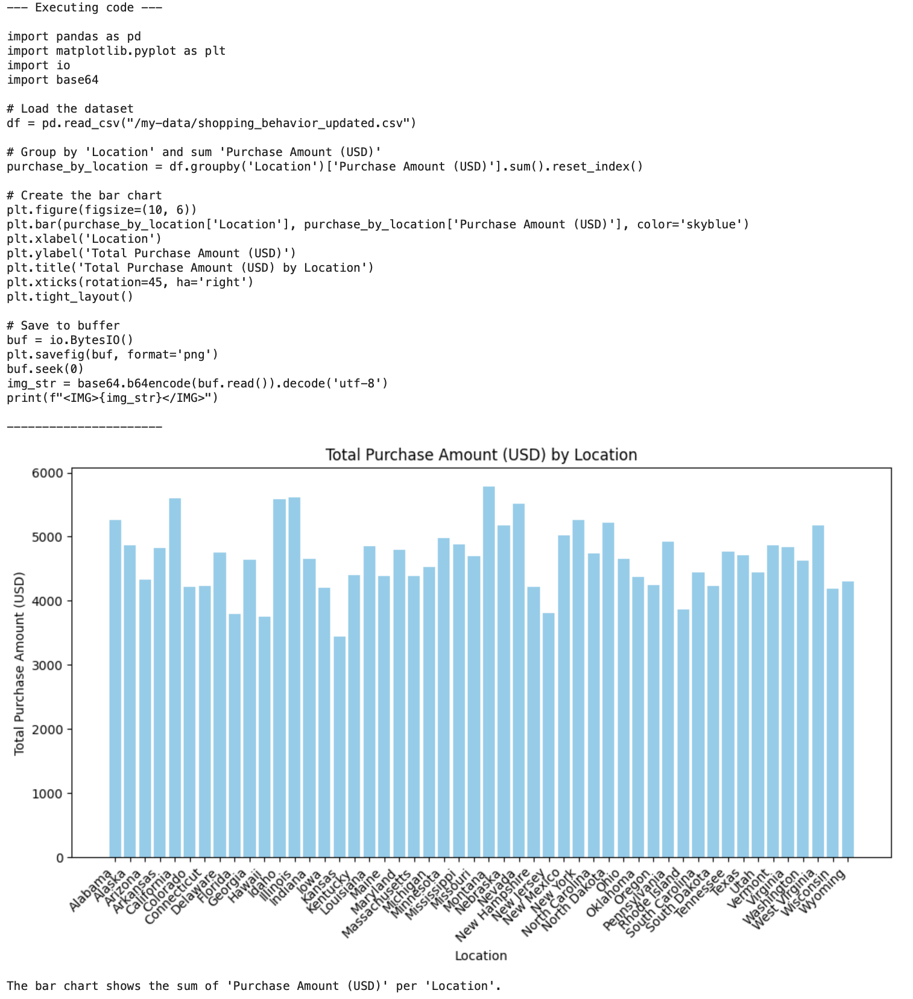

# AI Analytics with agent-sandbox

## Getting Started

### Prerequisites
- Running **GKE** cluster (**Standard** or **Autopilot**))
- `kubectl` access to a Kubernetes **GKE Standard** or **GKE Autopilot** cluster
- Agent-sandbox installed on GKE. Here is the ([Installation Guide](../../getting_started/))

## Deploy analytics tools

This section describes how to build Docker image that defines analytics tool for an ADK agent, push the Docker image to a Artifact Registry repository and deploy the pushed image.

Run the following commands:

```bash
cd analytics-tool
```

Create a repository in Artifact Registry:

```bash
gcloud artifacts repositories create analytics \
    --project=${PROJECT_ID} \
    --repository-format=docker \
    --location=us \
    --description="Analytics Repo"
```

Create a repository in Artifact Registry.

```bash
gcloud builds submit .
```

After build is completed, change `$PROJECT_ID` in `sandbox-python.yaml` and apply it:

```bash
kubectl apply -f sandbox-python.yaml
kubectl apply -f analytics-svc.yaml
```

## Deploy jupyter lab

Deploy a jupyter lab to make some data analytics:

```bash
kubectl apply -f ../jupyterlab.yaml
```

Once it's running, port-forward the jupyterlab and access on `http://127.0.0.1:8888` by running this command:

```bash
kubectl port-forward "pod/jupyterlab-sandbox" 8888:8888
```

Follow the `welcome.ipynb` notebook (defined in `jupyterlab.yaml`).

## Analytics example

In the `Download the data` is described the dataset that will be used in the example. In the `Data analytics` is described the actual data analytics. Function `analyze_movies` with the `tool` decorator is defined in this section. In the docstring is described the instruction for the LLM how to use it. 

The example query looks like this:

```log
Load /my-data/shopping_behavior_updated.csv. This data has 'Purchase Amount (USD)' column. Create a bar chart showing a sum of 'Purchase Amount (USD)' per column 'Location'.
```

The agent will be able to generate code that will be executed in the agent-sandbox pod. For example, the code might look like this:


  
import pandas as pd
import matplotlib.pyplot as plt
import io
import base64

# Load the data
df = pd.read_csv('/my-data/shopping_behavior_updated.csv')

# Group by 'Location' and sum 'Purchase Amount (USD)'
purchase_amount_by_location = df.groupby('Location')['Purchase Amount (USD)'].sum()

# Create a bar chart
plt.figure(figsize=(10, 6))
purchase_amount_by_location.plot(kind='bar')
plt.title('Total Purchase Amount (USD) by Location')
plt.xlabel('Location')
plt.ylabel('Total Purchase Amount (USD)')
plt.xticks(rotation=45, ha='right')
plt.tight_layout()

# Save to buffer
buf = io.BytesIO()
plt.savefig(buf, format='png')
buf.seek(0)
img_str = base64.b64encode(buf.read()).decode('utf-8')
print(f"{img_str}</IMG>")
  
  
package main

import (
	"bytes"
	"encoding/base64"
	"encoding/csv"
	"fmt"
	"image/color"
	"log"
	"os"
	"sort"
	"strconv"

	"gonum.org/v1/plot"
	"gonum.org/v1/plot/plotter"
	"gonum.org/v1/plot/vg"
	"gonum.org/v1/plot/vg/draw"
	"gonum.org/v1/plot/vg/vgimg"
)

func main() {
	// Load the CSV
	f, err := os.Open("/my-data/shopping_behavior_updated.csv")
	if err != nil {
		log.Fatalf("open csv: %v", err)
	}
	defer f.Close()

	reader := csv.NewReader(f)
	records, err := reader.ReadAll()
	if err != nil {
		log.Fatalf("read csv: %v", err)
	}

	if len(records) < 2 {
		log.Fatal("csv has no data rows")
	}

	// Find column indices
	header := records[0]
	locationIdx, amountIdx := -1, -1
	for i, col := range header {
		switch col {
		case "Location":
			locationIdx = i
		case "Purchase Amount (USD)":
			amountIdx = i
		}
	}
	if locationIdx == -1 || amountIdx == -1 {
		log.Fatal("required columns not found in CSV")
	}

	// Group by Location, sum Purchase Amount
	totals := make(map[string]float64)
	for _, row := range records[1:] {
		if locationIdx >= len(row) || amountIdx >= len(row) {
			continue
		}
		loc := row[locationIdx]
		amt, err := strconv.ParseFloat(row[amountIdx], 64)
		if err != nil {
			continue
		}
		totals[loc] += amt
	}

	// Sort locations alphabetically for consistent ordering
	locations := make([]string, 0, len(totals))
	for loc := range totals {
		locations = append(locations, loc)
	}
	sort.Strings(locations)

	// Build bar chart values
	values := make(plotter.Values, len(locations))
	for i, loc := range locations {
		values[i] = totals[loc]
	}

	// Create plot
	p := plot.New()
	p.Title.Text = "Total Purchase Amount (USD) by Location"
	p.Y.Label.Text = "Total Purchase Amount (USD)"
	p.X.Label.Text = "Location"

	bars, err := plotter.NewBarChart(values, vg.Points(20))
	if err != nil {
		log.Fatalf("create bars: %v", err)
	}
	bars.Color = color.RGBA{R: 70, G: 130, B: 180, A: 255} // steel blue
	bars.Offset = 0

	p.Add(bars)

	// Set X tick labels to location names, rotated
	p.NominalX(locations...)
	p.X.Tick.Label.Rotation = 0.785 // ~45 degrees in radians
	p.X.Tick.Label.XAlign = draw.XRight

	// Render to PNG in memory (10x6 inches at 96 DPI ≈ 960x576px)
	width := 10 * vg.Inch
	height := 6 * vg.Inch
	img := vgimg.New(width, height)
	dc := draw.New(img)
	p.Draw(dc)

	var buf bytes.Buffer
	png := vgimg.PngCanvas{Canvas: img}
	if _, err := png.WriteTo(&buf); err != nil {
		log.Fatalf("encode png: %v", err)
	}

	encoded := base64.StdEncoding.EncodeToString(buf.Bytes())
	fmt.Printf("%s</IMG>\n", encoded)
}
  



In the end the code prints an encoded image. Inside the tool definition the regex expression is used to extract this string, decode, and plot it.



## Cleanup

```bash
gcloud artifacts repositories delete analytics \
    --project=${PROJECT_ID} \
    --location=us
```
