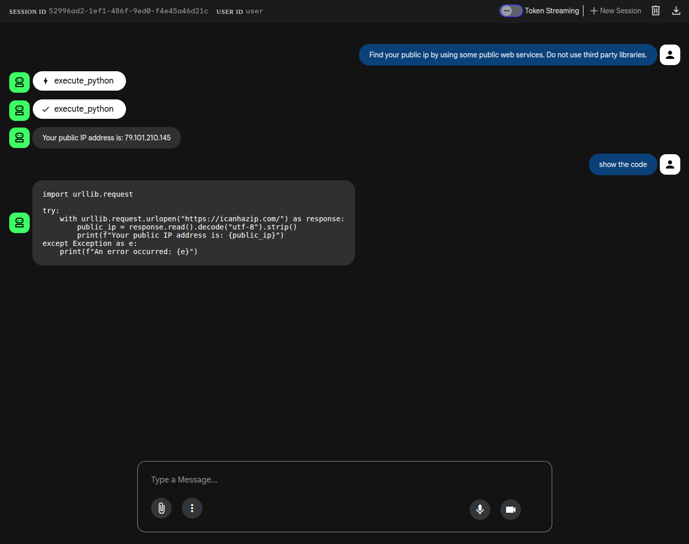

# Using Agent Sandbox as a Tool in Agent Development Kit (ADK)

The guide walks you through the process of creating a simple [ADK](https://google.github.io/adk-docs/) agent that is able to use agent sandbox as a tool.

## Installation

1. Install the Agent-Sandbox controller and CRDs to a cluster. You can follow the instructions from the [installation section from the Getting Started page](/README.md/#installation).

2. Install the Agent Sandbox [router](/clients/python/agentic-sandbox-client/README.md#setup-deploying-the-router)

3. Create a Python virtual environment:
   ```sh
   python3 -m venv .venv
   source .venv/bin/activate
   ```

4. Install the dependencies:
   ```sh
   export VERSION="main"
   pip install google-adk==1.19.0 "git+https://github.com/kubernetes-sigs/agent-sandbox.git@${VERSION}#subdirectory=clients/python/agentic-sandbox-client"
   ```

5. Create a new ADK project:
   ```sh
   adk create coding_agent
   ```

6. Replace the content of the `coding_agent/agent.py` file with the following:

   ```sh
   from google.adk.agents.llm_agent import Agent
   from agentic_sandbox import SandboxClient
   
   
   def execute_python(code: str):
       with SandboxClient(
           template_name="python-sandbox-template",
           namespace="default"
       ) as sandbox:
           sandbox.write("run.py", code)
           result = sandbox.run("python3 run.py")
           return result.stdout
   
   
   root_agent = Agent(
       model='gemini-2.5-flash',
       name='coding_agent',
       description="Writes Python code and executes it in a sandbox.",
       instruction="You are a helpful assistant that can write Python code and execute it in the sandbox. Use the 'execute_python' tool for this purpose.",
       tools=[execute_python],
   )
   ```
   
   As you can see, the Agent Sandbox is called by a wrapper function `execute_python` which, in turn, is used by the `Agent` class as a tool.

7. Run the agent in ADK's built in server:
   ```sh
   adk web
   ```

## Testing

1. Open the agent's page: http://127.0.0.1:8000.

2. Tell the agent to generate some code and execute it in the sandbox:




The agent should generate the code and execute it in the agent-sandbox.


