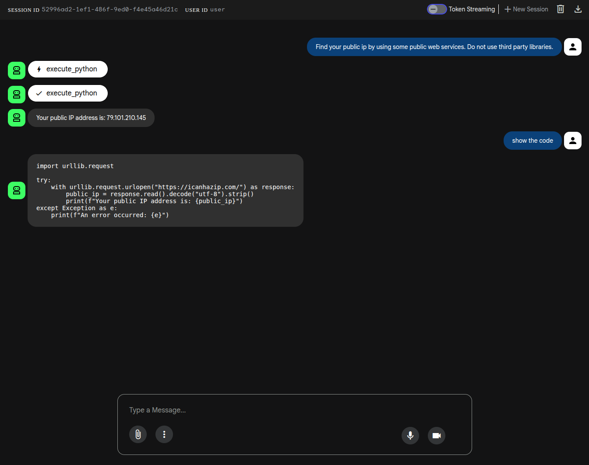

# Using Agent Sandbox as a Tool in Agent Development Kit (ADK)

The guide walks you through the process of creating a simple [ADK](https://google.github.io/adk-docs/) agent that is able to use agent sandbox as a tool.

## Installation

1. Install the Agent-Sandbox controller and CRDs to a cluster. You can follow the instructions from the [installation section from the Getting Started page](/README.md/#installation).

2. Install the Agent Sandbox [router](/clients/python/agentic-sandbox-client/README.md#setup-deploying-the-router)

3. Create a Python virtual environment:
   ```sh
   python3 -m venv .venv
   source .venv/bin/activate
   ```

4. Install the dependencies:
   ```sh
   export VERSION="main"
   pip install google-adk==1.19.0 "git+https://github.com/kubernetes-sigs/agent-sandbox.git@${VERSION}#subdirectory=clients/python/agentic-sandbox-client"
   ```

5. Create a new ADK project:
   ```sh
   adk create coding_agent
   ```

6. Replace the content of the `coding_agent/agent.py` file with the following:


   ```python
   from google.adk.agents.llm_agent import Agent
   from k8s_agent_sandbox import SandboxClient
   
   
   def execute_python(code: str):
       sb = SandboxClient()
       sandbox = sb.create_sandbox(warmpool="python-sandbox-pool", namespace="default")
       try:
        sandbox.files.write("run.py", code)
        result = sandbox.commands.run("python3 run.py")
        return result.stdout
       finally:
         sandbox.terminate()
   
   
   root_agent = Agent(
       model='gemini-2.5-flash',
       name='coding_agent',
       description="Writes Python code and executes it in a sandbox.",
       instruction="You are a helpful assistant that can write Python code and execute it in the sandbox. Use the 'execute_python' tool for this purpose.",
       tools=[execute_python],
   )
   ```

   ```go
   package main

   import (
   	"context"
   	"fmt"
   	"log"
   	"os"

   	"google.golang.org/adk/agent"
   	"google.golang.org/adk/agent/llmagent"
   	"google.golang.org/adk/cmd/launcher"
   	"google.golang.org/adk/cmd/launcher/full"
   	"google.golang.org/adk/model/gemini"
   	"google.golang.org/adk/tool"
   	"google.golang.org/adk/tool/functiontool"
   	"google.golang.org/genai"

   	"sigs.k8s.io/agent-sandbox/clients/go/sandbox"
   )

   type executePythonArgs struct {
   	Code string `json:"code" jsonschema:"The Python code to execute in the sandbox."`
   }

   type executePythonResult struct {
   	Stdout string `json:"stdout"`
   	Error  string `json:"error,omitempty"`
   }

   func executePython(_ tool.Context, args executePythonArgs) (executePythonResult, error) {
   	ctx := context.Background()

   	client, err := sandbox.NewClient(ctx, sandbox.Options{Namespace: "default"})
   	if err != nil {
   		return executePythonResult{Error: err.Error()}, nil
   	}

   	sb, err := client.CreateSandbox(ctx, "python-sandbox-pool", "default")
   	if err != nil {
   		return executePythonResult{Error: err.Error()}, nil
   	}
   	defer sb.Close(ctx)

   	if err := sb.Files().Write(ctx, "run.py", []byte(args.Code)); err != nil {
   		return executePythonResult{Error: err.Error()}, nil
   	}

   	result, err := sb.Commands().Run(ctx, "python3 run.py")
   	if err != nil {
   		return executePythonResult{Error: err.Error()}, nil
   	}
   	if result.ExitCode != 0 {
   		return executePythonResult{Error: fmt.Sprintf("run.py exited with code %d: %s", result.ExitCode, result.Stderr)}, nil
   	}
   	return executePythonResult{Stdout: result.Stdout}, nil
   }

   func main() {
   	ctx := context.Background()

   	model, err := gemini.NewModel(ctx, "gemini-2.5-flash", &genai.ClientConfig{
   		APIKey: os.Getenv("GOOGLE_API_KEY"),
   	})
   	if err != nil {
   		log.Fatalf("create model: %v", err)
   	}

   	pythonTool, err := functiontool.New(functiontool.Config{
   		Name:        "execute_python",
   		Description: "Writes the provided Python code to a file and executes it in an isolated sandbox, returning stdout.",
   	}, executePython)
   	if err != nil {
   		log.Fatalf("create tool: %v", err)
   	}

   	rootAgent, err := llmagent.New(llmagent.Config{
   		Name:        "coding_agent",
   		Model:       model,
   		Description: "Writes Python code and executes it in a sandbox.",
   		Instruction: "You are a helpful assistant that can write Python code and execute it in the sandbox. Use the 'execute_python' tool for this purpose.",
   		Tools:       []tool.Tool{pythonTool},
   	})
   	if err != nil {
   		log.Fatalf("create agent: %v", err)
   	}

   	config := &launcher.Config{
   		AgentLoader: agent.NewSingleLoader(rootAgent),
   	}

   	l := full.NewLauncher()
   	if err = l.Execute(ctx, config, os.Args[1:]); err != nil {
   		log.Fatalf("run failed: %v\n\n%s", err, l.CommandLineSyntax())
   	}
   }
   ```

   As you can see, the Agent Sandbox is called by a wrapper function `execute_python` which, in turn, is used by the `Agent` class as a tool.

7. Run the agent in ADK's built in server:
   ```sh
   adk web
   ```

## Testing

1. Open the agent's page: http://127.0.0.1:8000.

2. Tell the agent to generate some code and execute it in the sandbox:




The agent should generate the code and execute it in the agent-sandbox.


