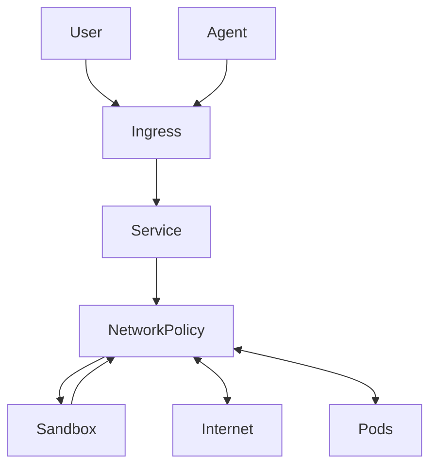

# Composing Sandbox with Network Policies

The `Sandbox` API is a low-level primitive for creating secure sandboxes. In real-world scenarios, you often want to compose a `Sandbox` with other Kubernetes resources, such as `NetworkPolicy`, `Ingress` and `Service`, to create a more complete and secure "agentic sandbox" environment.

* `Ingress` can be used to expose the Sandbox to Users and Agents outside the cluster. 
* `NetworkPolicy` can be used to control who can connect to the Sandbox and limit the Sandbox outgoing connections to other pods or the internet.  
* `Service` can be used to expose the Sandbox ports for `Ingress`  



This composition can be achieved in multiple ways:

*  **Writing a custom controller:** You can write a dedicated Kubernetes controller that watches for a higher-level CRD and creates the `Sandbox`, `NetworkPolicy`, and `Service` resources.
*  **Using a tool like KRO:** [KRO (Kubernetes Resource Orchestrator)](https://kro.run/docs/overview) allows you to define composite resources declaratively using a `ResourceGraphDefinition` (RGD). This creates a server side CRD that can be consumed by users.
* **Using Helm:** Similar to KRO, we can use Helm to create a client side composition of resources and use the helm-cli to manage it.

This example demonstrates the second approach, using KRO to define a new `AgenticSandbox` CRD that encapsulates a `Sandbox`, a `NetworkPolicy`, and a `Service`.

The `Service` created here is distinct from the one created by the `agent-sandbox` controller. This layering allows for more complex networking configurations and showcases the value of composing resources.

## Brief introduction to KRO

KRO is a powerful tool for defining and managing composite resources in Kubernetes. At its core, KRO introduces the `ResourceGraphDefinition` (RGD) custom resource. An RGD allows you to declaratively specify a graph of Kubernetes resources that should be created, updated, and deleted together as a single unit. When an RGD is applied to a cluster, KRO automatically generates a new Custom Resource Definition (CRD) based on the RGD's schema. Users can then interact with this new, higher-level CRD, and KRO will handle the orchestration of the underlying resources defined in the RGD. This enables administrators to define complex, opinionated abstractions that users can consume easily, without needing to manage the individual components.

## Example: Using KRO to create an `AgenticSandbox`

### Clone the repository
First, clone the repository and navigate to the repository directory
```
# Clone the repository
git clone https://github.com/kubernetes-sigs/agent-sandbox.git

# Navigate to the repository directory
cd agent-sandbox
```

### Install KRO

Install KRO on your cluster, by running the script:
```
./dev/tools/install-kro
```

### Create RGD

Install the `ResourceGraphDefinition` (RGD) which defines our new `AgenticSandbox` CRD

```
# Switch to the examples directory
cd examples/composing-sandbox-nw-policies

# Install the RGD
kubectl apply -f rgd.yaml
```

Validate that the RGD is installed correctly:

```
$ kubectl get rgd
NAME              APIVERSION   KIND             STATE    AGE
agentic-sandbox   v1alpha1     AgenticSandbox   Active   6m38s
```

Validate that the new `AgenticSandbox` CRD is installed correctly:
```
$ kubectl get crd
NAME                                      CREATED AT
agenticsandboxes.custom.agents.x-k8s.io   2025-09-20T05:03:49Z  # << THIS
resourcegraphdefinitions.kro.run          2025-09-20T04:35:37Z
sandboxes.agents.x-k8s.io                 2025-09-19T22:40:05Z
```

### Create an `AgenticSandbox`

You can now create an example `AgenticSandbox` resource:

```yaml
apiVersion: custom.agents.x-k8s.io/v1alpha1
kind: AgenticSandbox
metadata:
  name: demo
spec:
  image: nginx
  service:
    port: 80
```

Apply it to the cluster:
```
kubectl apply -f instance.yaml
```

Check the status of the created resources:

```
kubectl get agenticsandboxes
kubectl get agenticsandboxes demo -o yaml
```

The KRO reconciler reconciles `AgenticSandbox` instance and creates the following resources:
* Sandbox
* Service
* NetworkPolicy (if enabled)
* Ingress (if enbled)

The user/agent can access the Sandbox via the Ingress or the Service as appropriate.

If needed the user can update `AgenticSandbox` instance and reapply.

Once done using the Sandbox, the user can delete the `AgenticSandbox` instance, and KRO will clean up all the resources it created:

```
kubectl delete agenticsandbox demo
```
