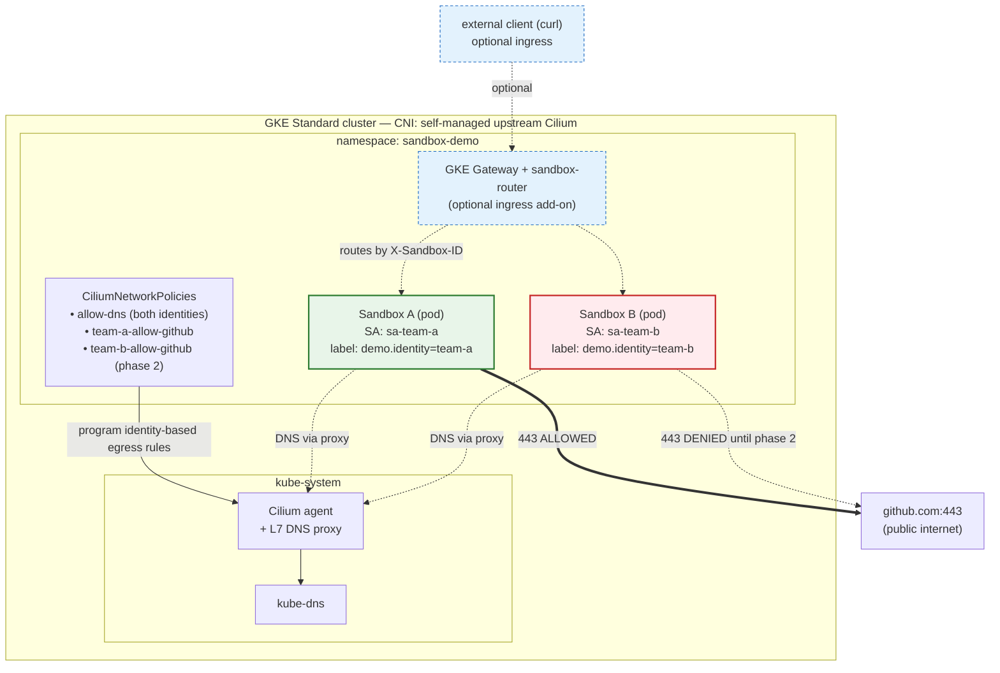
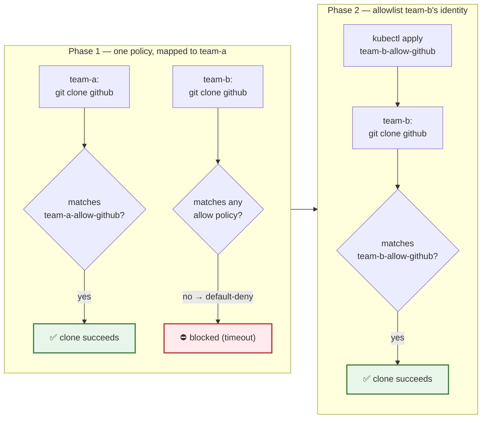
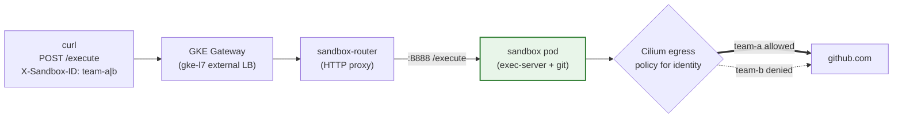
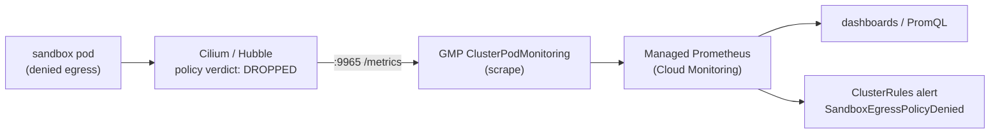

# Per-identity egress allowlisting for agent-sandbox (Cilium FQDN policy)

This self-contained example demonstrates, end-to-end on GKE, that **a network
policy bound to a workload identity controls which external domains a sandbox can
reach**.

Two agent-sandbox sandboxes get **distinct Kubernetes identities**. A Cilium
policy lets **identity A** reach `github.com` while **identity B** is denied —
proven by `git clone` succeeding in A and failing in B. Then a second policy
**allowlists identity B**, and its clone starts working too.

## Architecture



Each sandbox pod carries a `demo.identity` label (and its own ServiceAccount).
Cilium derives the pod's **security identity from the label, not the SA** — the
SA is kept only for hygiene (see "A note on the ServiceAccount" below). Every
egress packet is evaluated by the Cilium dataplane against
the `CiliumNetworkPolicies`: DNS is allowed for both identities (and snooped by
the L7 DNS proxy so `toFQDNs` can resolve `github.com`), but only the identity
named in a `*-allow-github` policy may open 443 to github. The blue dashed path
is the **optional gateway routing** ingress add-on (see below); the egress
decision is identical regardless of how the request arrives.

### Phase flow (the demo story)



## Why Cilium + GKE Standard (not Autopilot)

Upstream Kubernetes `NetworkPolicy` can only match IP CIDRs — **not domains**.
Allowing `github.com` by name requires a CNI extension. This demo uses real
**`CiliumNetworkPolicy` with `toFQDNs`**, which needs control of the CNI. GKE
Autopilot (and Dataplane V2) only exposes GKE's `FQDNNetworkPolicy` wrapper, not
raw Cilium policy — so we run **GKE Standard with self-managed upstream Cilium**.

Cilium derives a label-based **security identity** for every pod, which is the
natural carrier of "the identity a policy maps to": each sandbox pod carries a
`demo.identity=<team>` label, and each policy's `endpointSelector` matches that
label. (The pod also has its own Kubernetes ServiceAccount, but that is *not*
what Cilium keys on — see "A note on the ServiceAccount" below.)

## How "policy maps to identity" works here

- Each Sandbox carries a propagated pod label **`demo.identity: team-a|team-b`**
  (this is what Cilium turns into a security identity) and runs as its own
  **ServiceAccount** (`sa-team-a` / `sa-team-b`).
- `10-cilium-allow-dns.yaml` selects **both** identities. In Cilium, once any
  egress rule selects an endpoint it becomes **default-deny egress** — so this
  both (a) locks egress down to DNS only and (b) enables the L7 DNS proxy that
  `toFQDNs` needs to resolve domains.
- `20-cilium-team-a-allow-github.yaml` opens `github.com:443` for **team-a only**.
- team-b has no such rule → its github traffic is dropped.
- `40-cilium-team-b-allow-github.yaml` (phase 2) adds the same allow for team-b.

### A note on the ServiceAccount

The two ServiceAccounts (`sa-team-a` / `sa-team-b`) are **not required** for the
egress demo. Cilium builds each pod's security identity from its **labels**, so
the `CiliumNetworkPolicy` `endpointSelector` matches `demo.identity`, never the
SA. The sandboxes also set `automountServiceAccountToken: false`, so no token is
even mounted. You could delete the SAs and the allow/deny behavior would be
unchanged.

They're kept on purpose, for realism rather than function:

- **Hygiene** — without `serviceAccountName`, the pods would run as the namespace
  `default` SA. A dedicated SA per workload is good practice.
- **Workload Identity anchor** — if a sandbox ever needs to call a Google Cloud
  API (e.g. read a GCS bucket), this KSA is exactly what you'd map to an IAM
  principal via Workload Identity Federation. The SA is the GCP-facing identity;
  the label is the network-facing identity. They are independent layers that
  happen to move together here.

## Requirements

- `gcloud` (authenticated; project access to create a GKE cluster)
- `kubectl`
- `cilium` CLI — https://github.com/cilium/cilium-cli/releases (or `brew install cilium-cli`)
- `hubble` CLI — only for the optional flow-log inspection in Observability
  (`hubble observe`). It's a **separate** binary from `cilium-cli`:
  https://github.com/cilium/hubble/releases (or `brew install hubble`)
- For the optional gateway-routing add-on: the Cloud Build API enabled (images are
  built remotely — no local `docker` needed), plus a local `python3` (used by
  `scripts/test-ingress.sh` to parse gateway responses)

## Quick start

```bash
cd examples/demo-cilium-egress

# Provision everything: cluster -> Cilium -> agent-sandbox -> demo resources.
./scripts/setup-all.sh

# Run the e2e assertions (phase 1 deny/allow, phase 2 allowlist).
./scripts/test.sh
```

Override defaults via env vars (see `env.sh`), e.g. `ZONE=us-west1-a ./scripts/setup-all.sh`.

## What each script does

| Script | Purpose |
|---|---|
| `scripts/01-create-cluster.sh` | GKE Standard cluster, **no** Dataplane V2 (guards against `anetd`). |
| `scripts/02-install-cilium.sh` | Installs upstream Cilium (`gke.enabled`, `ipam=kubernetes`) + DNS proxy. |
| `scripts/03-install-agent-sandbox.sh` | Applies the latest agent-sandbox core + extensions release. |
| `scripts/04-deploy-demo.sh` | Namespace, identities, baseline DNS policy, team-a allow, two sandboxes. |
| `scripts/setup-all.sh` | Runs 01→04 (idempotent). |
| `scripts/test.sh` | E2E verification; exits non-zero on any failed assertion. |
| `scripts/teardown.sh` | Removes demo resources; `--all` also deletes the cluster. |
| `scripts/optional-gateway-routing.sh` | **Optional**: builds the sandbox-router + exec-server images (Cloud Build) and deploys router + GKE Gateway (ingress). |
| `scripts/05-observability.sh` | **Optional**: enables Managed Prometheus + Hubble metrics and ships egress-violation metrics to Cloud Monitoring. |

## Manifests

| File | Role |
|---|---|
| `manifests/00-namespace-and-identities.yaml` | Namespace + `sa-team-a` / `sa-team-b`. |
| `manifests/10-cilium-allow-dns.yaml` | Baseline: default-deny egress + DNS (for both identities). |
| `manifests/20-cilium-team-a-allow-github.yaml` | Allow `github.com` for team-a. |
| `manifests/30-sandboxes.yaml` | Two Sandboxes with distinct identities. |
| `manifests/40-cilium-team-b-allow-github.yaml` | Phase 2: allow `github.com` for team-b. |
| `manifests/router/` | Optional sandbox-router + GKE Gateway (used by the ingress script). |
| `manifests/observability/` | Optional GMP `ClusterPodMonitoring` (scrape Hubble) + `ClusterRules` (alert). |

## Manual verification

```bash
# team-a: succeeds
kubectl exec -n sandbox-demo sandbox-team-a -- \
  sh -c 'git clone --depth 1 https://github.com/rtyley/small-test-repo /tmp/r && echo OK'

# team-b: fails (DNS resolves, but 443 to github is dropped)
kubectl exec -n sandbox-demo sandbox-team-b -- \
  sh -c 'timeout 30 git clone --depth 1 https://github.com/rtyley/small-test-repo /tmp/r; echo exit=$?'

# allowlist team-b, then it succeeds
kubectl apply -f manifests/40-cilium-team-b-allow-github.yaml
```

See drops with Hubble:

```bash
cilium hubble enable
hubble observe -n sandbox-demo --from-label demo.identity=team-b --verdict DROPPED
```

## Optional: gateway routing (full ingress + egress path)

The core demo proves egress via `kubectl exec`. To also exercise agent-sandbox's
**ingress "gateway routing"** — an external client → **GKE Gateway** → **sandbox-router**
→ **sandbox** `/execute` → `git clone` — run the add-on. It builds two images with
**Cloud Build** (no local docker needed), enables the GKE Gateway API, swaps the
sandboxes to an HTTP exec-server image (same identities/policies), and deploys the
router + Gateway.

> ⚠️ **DEMO ONLY — do not run on a long-lived or shared cluster.** This add-on
> fronts the sandbox-router with a **public** external L7 Gateway, so the sandbox
> `/execute` endpoint is reachable from the internet. By default the script mints
> a random Bearer token into a `sandbox-router-auth` Secret and the router
> **requires** it (`test-ingress.sh` reads the Secret and sends the token), so the
> public endpoint is authenticated out of the box. You can still expose an
> **unauthenticated** `/execute` — i.e. remote code execution for anyone who finds
> the Gateway IP — only by deliberately opting in with
> `ALLOW_UNAUTHENTICATED_ROUTER=true ./scripts/optional-gateway-routing.sh`. Even
> with auth on, use a throwaway demo cluster and tear it down when finished
> (`./scripts/teardown.sh --all`); for real use also restrict the Gateway to an
> internal/allowlisted front end.

```bash
./scripts/optional-gateway-routing.sh   # build images, enable Gateway API, deploy router+Gateway
./scripts/test-ingress.sh               # drive git clone THROUGH the gateway; asserts allow/deny/allowlist
```



The same per-identity Cilium policy still decides the outcome — now the request
arrives through the gateway instead of `kubectl exec`. Ingress to the sandbox is
unaffected because the policies are egress-only (Cilium default-deny is
per-direction).

## Optional: observability — catching egress violations

As the cluster admin you want to know when a sandbox tries something it isn't
allowed to. A denied egress is **not** silent inside Cilium — it's a Hubble
policy-verdict / drop event. This add-on enables **Hubble metrics** and scrapes
them into **Google Managed Prometheus** (Cloud Monitoring), so violations are
queryable and alertable.

```bash
./scripts/05-observability.sh   # enable Managed Prometheus + Hubble metrics, install scrape + alert rule
```



**The signal.** Each Cilium agent exports flow metrics on port `9965`. The two
that matter, with the labels this example configures (`sourceContext=pod`,
`destinationContext=dns`):

```text
hubble_policy_verdicts_total{action="dropped", direction="egress",
    source="sandbox-demo/sandbox-team-b", destination="github.com"}
hubble_drop_total{reason="POLICY_DENIED",
    source="sandbox-demo/sandbox-team-b", destination="github.com"}
```

So a violation tells you **who** (`source` = namespace/sandbox = identity) and
**what** (`destination` = the FQDN), e.g. *sandbox-team-b → github.com, denied*.

**Query it** (PromQL, for a dashboard or alert):

```promql
sum by (source, destination) (
  rate(hubble_policy_verdicts_total{action="dropped", direction="egress"}[5m])
)
```

**See it in the Google Cloud Console (Metrics Explorer):**

1. Open **Monitoring → Metrics explorer**:
   `https://console.cloud.google.com/monitoring/metrics-explorer?project=<PROJECT>`
2. Click the **PromQL** tab (toggles the visual builder to a code editor).
3. Paste a query and **Run**, with the time range set to **Last 1 hour**:
   ```promql
   hubble_policy_verdicts_total{action="dropped", direction="egress"}
   ```
   You'll see a series labeled `source="sandbox-demo/sandbox-team-b"`,
   `destination="github.com"` — that's the denial (a counter that steps up on each
   blocked attempt). For a rate line, query the recording rule
   `sandbox:egress_policy_denied:rate5m` instead.
4. Prefer the visual builder? Click **Select a metric** and search for
   `hubble_policy_verdicts_total` (full type
   `prometheus.googleapis.com/hubble_policy_verdicts_total/counter`), then filter
   `action=dropped`, `direction=egress` and group by `source`, `destination`.
5. **Save Chart → to a new Dashboard** to keep a standing "egress violations" panel.

These metrics live under **Managed Service for Prometheus** (resource type
*Prometheus Target*); the PromQL tab is the natural way to query them. If a graph
looks empty, widen the time window and generate a fresh denial with the
`kubectl exec ... git clone` from "Manual verification" above.

Against Managed Prometheus directly (scripted) — this endpoint requires an
**Application Default Credentials** token (`gcloud auth application-default login`
first). A plain `gcloud auth print-access-token` is rejected here
(`ACCESS_TOKEN_TYPE_UNSUPPORTED`), so ADC is intentional:

```bash
curl -s -H "Authorization: Bearer $(gcloud auth application-default print-access-token)" \
  "https://monitoring.googleapis.com/v1/projects/<PROJECT>/location/global/prometheus/api/v1/query" \
  --data-urlencode 'query=hubble_policy_verdicts_total{action="dropped",direction="egress"}'
```

`manifests/observability/clusterrules.yaml` adds a recording rule
(`sandbox:egress_policy_denied:rate5m`) and an alert (`SandboxEgressPolicyDenied`)
evaluated by GMP's managed rule-evaluator. Delivering that alert to a channel
additionally needs an Alertmanager target (managed Alertmanager via
`OperatorConfig`, or your own) — see the GMP rule-evaluation docs.

**Per-event forensics** (which identity, which domain, when): use Hubble flow
logs rather than metrics —

```bash
cilium hubble enable        # already enabled by 05-observability.sh
hubble observe -n sandbox-demo --verdict DROPPED   # add --follow for live
```

…and ship those to Cloud Logging (fluent-bit) or run Hubble UI for a visual map.

> **Gotchas (handled by the script):**
> - GMP collectors that started **before** Cilium can be stuck with "no route to
>   host" to the API server — the script restarts the `gmp-system/collector`
>   daemonset so they pick up Cilium networking.
> - This uses **Cilium Hubble**, not GKE Dataplane-V2 network-policy logging
>   (we run self-managed Cilium). GMP scrapes regardless of CNI; the metrics just
>   come from Hubble.

## Teardown

```bash
./scripts/teardown.sh        # remove demo resources, keep cluster
./scripts/teardown.sh --all  # also delete the GKE cluster
```

## Notes / gotchas

- `toFQDNs` depends on the DNS proxy: `10-cilium-allow-dns.yaml` must be applied
  or even the allowed clone fails (DNS can't resolve through Cilium).
- HTTPS `git clone` uses `github.com:443`; `codeload.github.com` is allowed
  defensively. If a clone unexpectedly fails, widen to `*.github.com` and check
  Hubble.
- Image pulls happen on the node, not under the pod's egress policy, so
  `alpine/git` pulls fine even under default-deny.
- The cluster is **GKE Standard without Dataplane V2** on purpose; `01-create`
  fails fast if `anetd` is detected.
