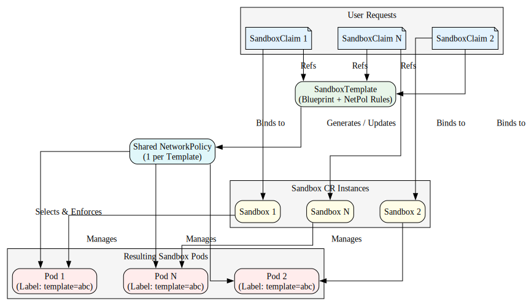

# Agent Sandbox Network Policy Management

This document outlines how network traffic is secured, managed, and customized for AI agents running within the Agent Sandbox environment.

## Overview

The Agent Sandbox employs a Template-Level Shared Network Policy model. Instead of generating hundreds of individual policies per `SandboxClaim`, the controller generates and maintains a single, highly optimized Kubernetes `NetworkPolicy` for each `SandboxTemplate`.

 When a `SandboxClaim` is created (whether cold-started or adopted from a warm pool), the resulting `Sandbox` and Pod are associated with their parent template's shared network policy.

To make discovery straightforward, the generated policy is predictably named `<template-name>-network-policy` and is created in the same namespace as the template.




## What It Does

- Shared Enforcement: Applies a single Kubernetes `NetworkPolicy` to all sandboxes derived from a specific `SandboxTemplate`.

- Targeted Matching: The controller automatically injects the label `agents.x-k8s.io/sandbox-template-ref-hash` onto every `Sandbox` Pod. The shared `NetworkPolicy` uses this exact label in its `podSelector` to enforce rules precisely without bleeding into other workloads.

- Dynamic Updates: If an administrator updates the `NetworkPolicy` rules within a `SandboxTemplate`, the underlying Kubernetes `NetworkPolicy` is updated immediately. The cluster's CNI dynamically enforces these new rules across all existing and future sandboxes.

- Default-Deny Posture: Automatically enforces a strict "Default Deny" posture for any template under its management.

- DNS Protection: When using the Secure-by-Default posture, the controller overrides the Pod's DNS configuration to use public external resolvers (Google/Cloudflare) to prevent internal cluster DNS enumeration only if the PodSpec leaves `dnsPolicy` unset (empty string). If you explicitly set `dnsPolicy: ClusterFirst`, the controller will not apply this override.


## What It Doesn't Do

- No Per-Claim Policies: Individual `SandboxClaim` resources cannot define their own network policies. Network rules are governed strictly at the template blueprint level.

- No Native L7 Filtering: The built-in management relies on standard Kubernetes `NetworkPolicy`, which operates at Layer 3 and Layer 4 (IP and Port). It does not natively inspect HTTP headers, paths, or L7 protocols.

- No Arbitrary Pod Selectors: The controller intentionally strips and manages the PodSelector and PolicyTypes fields internally to prevent accidental misconfiguration and ensure strict isolation boundaries.


## The "Secure by Default" Posture

If you create a `SandboxTemplate` and set `networkPolicyManagement: Managed` (or leave it blank, as this is the default) without specifying custom rules, the controller applies a highly restrictive **Secure Default** policy.

This is designed for running untrusted code safely:

**Ingress (Incoming Traffic)**

- **Allowed:**  Traffic is only allowed from the designated [Sandbox Router](../../../clients/python/agentic-sandbox-client/sandbox-router) (`app: sandbox-router`) residing in the `"agent-sandbox-system"` system namespace.

- **Blocked:** All other internal cluster traffic and external ingress is explicitly denied.

- **Note:** If your pod utilizes sidecars (e.g., Istio proxy, Datadog agent) that require health checks from the kubelet, these will be blocked by default unless explicitly allowed via custom rules.

**Egress (Outgoing Traffic)**

- **Allowed:** Public Internet Access (`0.0.0.0/0` and `::/0`).

- **Blocked:**

  - Private LAN ranges (RFC1918: `10.0.0.0/8`, `172.16.0.0/12`, `192.168.0.0/16`).

  - The Cloud Provider Metadata Server (`169.254.0.0/16`).

  - Internal IPv6 Unique Local Addresses (`fc00::/7`).

  - IPv6 Link-Local (`fe80::/10`).

  - Internal Cluster DNS (CoreDNS).


## Customizing Network Policies

When you provide a custom networkPolicy block within your template, it completely replaces the Secure Default rules. Your custom policy must explicitly define all allowed traffic.

You can override the secure defaults by defining custom rules within the `SandboxTemplate`. The schema uses standard Kubernetes `NetworkPolicyIngressRule` and `NetworkPolicyEgressRule` formats.

```yaml
apiVersion: extensions.agents.x-k8s.io/v1beta1
kind: SandboxTemplate
metadata:
  name: custom-net-template
spec:
  networkPolicyManagement: Managed
  networkPolicy:
    ingress:
      # Your custom ingress rules here
    egress:
      # Your custom egress rules here
```

**Example 1: Strict Air-Gapped Sandbox**

If you are running an agent that purely performs computation and requires absolute network isolation, you can pass empty arrays to explicitly block all traffic.

```yaml
apiVersion: extensions.agents.x-k8s.io/v1beta1
kind: SandboxTemplate
metadata:
  name: airgapped-template
spec:
  networkPolicyManagement: Managed
  networkPolicy:
    ingress: [] # Explicitly block all incoming traffic
    egress: []  # Explicitly block all outgoing traffic
```

**Example 2: External API & Internal DB Access**

Here is a practical example of a `SandboxTemplate` configured for an AI agent that requires access to an internal database, the public internet, and incoming health checks from a monitoring namespace.

```yaml
apiVersion: extensions.agents.x-k8s.io/v1beta1
kind: SandboxTemplate
metadata:
  name: custom-agent-template
spec:
  networkPolicyManagement: Managed
  networkPolicy:
    ingress:
      # 1. Allow incoming traffic on port 8080 from the 'monitoring' namespace
      #    (e.g., for Prometheus scraping a sidecar)
      - from:
        - namespaceSelector:
            matchLabels:
              kubernetes.io/metadata.name: monitoring
        ports:
          - protocol: TCP
            port: 8080

      # 2. Re-allow the standard Sandbox Router (required if you override defaults)
      - from:
        - namespaceSelector:
            matchLabels:
              kubernetes.io/metadata.name: agent-sandbox-system
          podSelector:
            matchLabels:
              app: sandbox-router

    egress:
      # 1. Allow outbound traffic to a specific internal Vector Database
      - to:
        - ipBlock:
            cidr: 10.10.10.100/32
        ports:
          - protocol: TCP
            port: 5432

      # 2. Allow outbound traffic to the public internet (for external API calls),
      #    while continuing to block all other internal networks and the metadata server.
      - to:
        - ipBlock:
            cidr: 0.0.0.0/0
            except:
              - 10.0.0.0/8
              - 172.16.0.0/12
              - 192.168.0.0/16
              - 169.254.0.0/16
        - ipBlock:
            cidr: "::/0"
            except:
              - "fc00::/7"
              - "fe80::/10"
```

- Total Override: Because the Secure Defaults are replaced, we must manually re-add the rule allowing ingress from the `sandbox-router` if we still want that functionality.  

- Granular Egress: We specify exactly which internal IP (`10.10.10.100/32`) and port (`5432`) the sandbox can access.  

- Retaining Internet Access: We copy the public internet egress rules from the secure defaults to ensure the agent can still make external API calls while blocking lateral movement across the internal cluster network.


**Example 3: GCP Workload Identity & Google Cloud Services (Vertex AI, GCS, etc.)**

If your AI sandboxes interact with Google Cloud APIs (e.g., Vertex AI model generation or reading/writing data to Google Cloud Storage buckets), you must configure your network policy to support **Workload Identity** and prevent latency hangs.

There are two critical gotchas to be aware of when using Google Cloud APIs inside a sandboxed environment:
1. **Workload Identity (169.254.169.254)**: Google Cloud SDKs authenticate by querying the GCP Metadata Server at `169.254.169.254`. This link-local address is blocked by default under the Secure-by-Default posture, so you must explicitly permit it.
2. **IPv6 / DNS**: Modern runtimes (such as Node.js clients using `fetch` or Python SDKs using libraries like `urllib3`, `requests`, or `aiohttp`) may attempt to reach Google API domains (like `aiplatform.googleapis.com` or `storage.googleapis.com`) over both IPv4 and IPv6. Because standard Kubernetes network policies are default-deny, if you omit the IPv6 egress block (`::/0`), the CNI may silently drop the outbound IPv6 packets. This can cause the application to hang for up to ~2 minutes before falling back to IPv4, depending on the runtime and network stack.

To support Google Cloud APIs natively without experiencing these latency hangs or resolution failures, you must:
1. Explicitly allow **both** IPv4 and IPv6 egress to the internet.
2. Add a separate, narrow egress rule allowing traffic only to the GCP Metadata Server (`169.254.169.254/32` on TCP port 80) rather than leaving the entire `169.254.0.0/16` link-local range exposed.
3. Configure custom DNS resolvers (like public Google/Cloudflare DNS) directly in the sandbox `podTemplate`. Since defining a custom `networkPolicy` disables the automatic "Secure-by-Default" DNS override, and since RFC1918 private subnets are blocked by the custom egress rules, the sandbox would be unable to reach internal cluster DNS (CoreDNS), causing DNS lookups for external domains to fail.

```yaml
apiVersion: extensions.agents.x-k8s.io/v1beta1
kind: SandboxTemplate
metadata:
  name: gcp-agent-template
spec:
  networkPolicyManagement: Managed
  networkPolicy:
    ingress:
      # Re-allow the standard Sandbox Router
      - from:
        - namespaceSelector:
            matchLabels:
              kubernetes.io/metadata.name: agent-sandbox-system
          podSelector:
            matchLabels:
              app: sandbox-router
    egress:
      # 1. Allow outbound IPv4 to the public internet (excluding private subnets and link-local)
      - to:
        - ipBlock:
            cidr: 0.0.0.0/0
            except:
              - 10.0.0.0/8
              - 172.16.0.0/12
              - 192.168.0.0/16
              - 169.254.0.0/16

      # 2. Allow outbound IPv6
      - to:
        - ipBlock:
            cidr: "::/0"
            except:
              - "fc00::/7"

      # 3. Allow narrow egress to the GCP Metadata Server for Workload Identity
      - to:
        - ipBlock:
            cidr: 169.254.169.254/32
        ports:
          - protocol: TCP
            port: 80

  podTemplate:
    spec:
      # Custom networkPolicies disable the automatic "Secure-by-Default" DNS override.
      # Since private subnets are blocked above, we must configure external public resolvers
      # here so that the sandbox can resolve public Google API domains.
      dnsPolicy: None
      dnsConfig:
        nameservers:
          - 8.8.8.8
          - 1.1.1.1
      # ... rest of the pod template spec (containers, volumes, etc.)
```


## Troubleshooting

**How can I confirm which network policy is actively applied to a Sandbox?**

Because policies are managed at the template level, you can view the active rules by inspecting the underlying Kubernetes `NetworkPolicy` created in the template's namespace. The policy will always be named `<template-name>-network-policy`.

```bash
kubectl get networkpolicy <template-name>-network-policy -n <namespace> -o yaml
```

**As a user, how do I determine what policies are attached to my SandboxClaim?**

Look at the `SandboxTemplate` referenced by your claim's `SandboxWarmPool`.

1. Run `kubectl get sandboxwarmpool <warmpool-name> -o yaml` to find the underlying template name.

2. Run `kubectl get sandboxtemplate <template-name> -o yaml`.

3. Check the `spec.networkPolicyManagement` field.

4. If it is `Managed` and `spec.networkPolicy` is empty, the Secure by Default posture is active. If `spec.networkPolicy` is populated, those exact custom rules are applied.

**Will admins be able to set default policies for Layer 7 (L7)?**

Not using the built-in `networkPolicy` field, as it relies on standard Kubernetes NetworkPolicies (L3/L4).

However, admins can manage L7 policies by changing the template's management mode:

```yaml
spec:
  networkPolicyManagement: Unmanaged
```

Setting the policy to `Unmanaged` tells the controller to step back entirely. Admins can then use an advanced CNI or Service Mesh (like Cilium, Istio, or Calico) to apply `CiliumNetworkPolicy` or `AuthorizationPolicy` resources that target the sandboxes using the `agents.x-k8s.io/sandbox-template-ref-hash` label, enabling full L7 inspection and defaults.

⚠️ **Security Warning:** When using `Unmanaged` mode, the Agent Sandbox controller completely steps aside. The administrator bears 100% responsibility for provisioning and enforcing appropriate network isolation using an advanced CNI or Service Mesh (e.g., CiliumNetworkPolicy or Istio AuthorizationPolicy) targeting the `agents.x-k8s.io/sandbox-template-ref-hash` label.

**What happens to legacy network policies on old SandboxClaims?**

The controller includes an automatic cleanup mechanism. If it detects a deprecated per-claim network policy (e.g., `<claim-name>-network-policy`), it will automatically delete it in favor of the shared template policy, ensuring no orphaned policies are left behind.