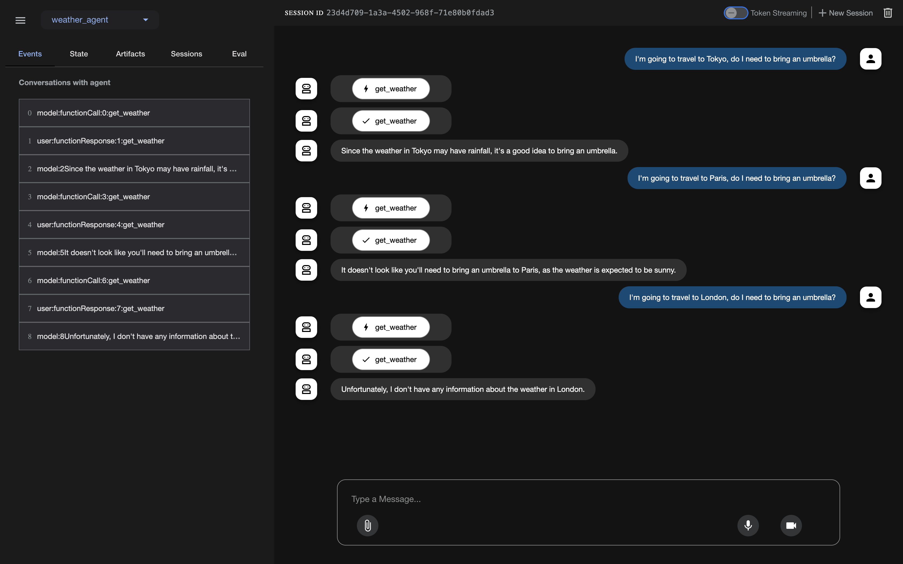
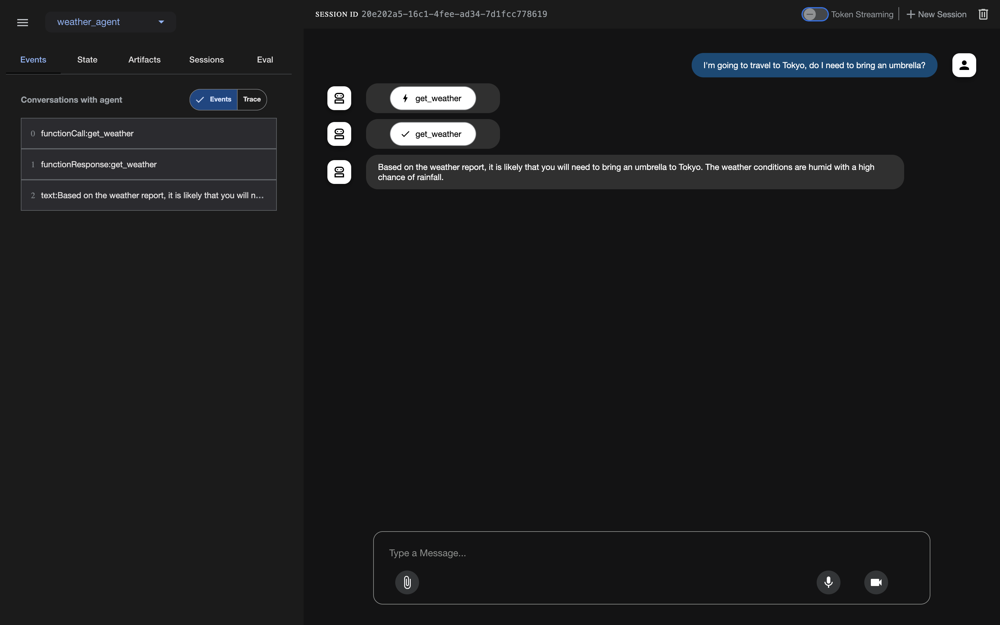

## Overview

In this tutorial we are going to create an agent that will receive user queries about weather conditions in various locations, parse the location and temperature unit (C/F) from the prompt and answer accordingly.
The agent will use the following tool:

- `get_weather`: to retrieve weather information, format, and present weather data with appropriate temperature symbols, handle edge cases for unknown locations and invalid queries

The project structure:

```
tutorials-and-examples/adk/llama/vllm/
├── deploy-agent/
│   ├── Dockerfile
│   ├── deploy-agent.yaml
│   ├── main.py
│   ├── requirements.txt
│   └── weather_agent/
│       ├── __init__.py
│       └── agent.py
│
├── deploy-llm/
│   └── deploy-llm.yaml
│
├── terraform/
│   ├── backend.tf
│   ├── example_vars.tfvars
│   ├── main.tf
│   ├── outputs.tf
│   ├── variables.tf
│   └── versions.tf
```

## Before you begin

Make sure you have installed:
   * terraform
   * gcloud CLI
   * git
   * kubectl

Also you will need to get a Huggingface API token with a read access.

Make sure you have enabled the following APIs:

* [GKE](https://console.cloud.google.com/marketplace/product/google/container.googleapis.com)
* [Artifact Registry API](https://console.cloud.google.com/marketplace/product/google/artifactregistry.googleapis.com)

## Create a GKE cluster

First of all, you need to clone the tutorials repository and go to the specific directory. Run these commands below:
  ```bash
  git clone https://github.com/ai-on-gke/tutorials-and-examples.git
  cd ./tutorials-and-examples/adk/llama/vllm
  ```

To create a GKE Autopilot cluster for this tutorial, you should go to the `terraform` folder:

  ```bash
  cd ./terraform
  ```

Copy `example_vars.tfvars` file as `vars.tfvars`. Replace the following variables with your actual values:

   * `<PROJECT_ID>`: with your Google project ID
   * `<CLUSTER_NAME>`: with any name you would like to

Run the following commands to create your GKE cluster:

  ```bash
  terraform init
  terraform apply -var-file=vars.tfvars
  ```

Run the following command to get an access to your cluster:
3. Install kuberay-operator via Helm:

  ```bash
  export PROJECT_ID=$(terraform output -raw project_id)
  export CLUSTER_NAME=$(terraform output -raw gke_cluster_name)
  gcloud container clusters get-credentials ${CLUSTER_NAME} --location=us-east4
  ```

## Deploy an LLM to a GKE Autopilot cluster

In this section we will use vLLM for the deployment and [meta-llama/Llama-3.1-8B-Instruct](https://huggingface.co/meta-llama/Llama-3.1-8B-Instruct) (you have to visit their site and request an access) as a core LLM. So far, you are currently in the `terraform` folder.

Go to the `deploy-llm` folder:

  ```bash
  cd ../deploy-llm
  ```

In this folder you can see the `deploy-llm.yaml` manifest, which creates a deployment with vLLM that serves Llama-3.1-8B-Instruct, template for the LLM, and a service that allows us to access this model via http protocol.

To successfully deploy our model, we need to create a HuggingFace secret (with at least read permissions) inside the GKE cluster and a configmap that contains our template.

Run these commands to create the HuggingFace secret:

  ```bash
  export HF_TOKEN=<YOUR_HF_TOKEN>
  kubectl create secret generic hf-token-secret \
      --from-literal=token=${HF_TOKEN} \
      --dry-run=client -o yaml | kubectl apply -f -
  ```

Now we can create our deployment and service with our LLM by running this command which runs vLLM with `--tool-call-parser=llama3_json`, `--enable-auto-tool-choice` and `--chat-template`. To learn more about options used check out [vLLM documentation](https://docs.vllm.ai/en/stable/features/tool_calling.html):

  ```bash
  kubectl apply -f deploy-llm.yaml
  ```

> [!NOTE]
> Note that in this manifest we also create a configmap with a chat template for our LLM.

You can check the status of the deployment by running `logs -f` command on the pod.
Once your logs look like this:

  ```log
  INFO 05-08 12:41:31 [launcher.py:36] Route: /v1/rerank, Methods: POST
  INFO 05-08 12:41:31 [launcher.py:36] Route: /v2/rerank, Methods: POST
  INFO 05-08 12:41:31 [launcher.py:36] Route: /invocations, Methods: POST
  INFO 05-08 12:41:31 [launcher.py:36] Route: /metrics, Methods: GET
  INFO:     Started server process [1]
  INFO:     Waiting for application startup.
  INFO:     Application startup complete.
  ```

### Testing

You can port-forward the service by running this command:

  ```bash
  kubectl port-forward svc/vllm-llama3-service 8000:8000
  ```

And invoke your model by running this command:

  ```bash
  curl http://127.0.0.1:8000/v1/chat/completions \
  -X POST \
  -H "Content-Type: application/json" \
  -d '{
      "model": "meta-llama/Llama-3.1-8B-Instruct",
      "messages": [
          {
          "role": "system",
          "content": "You are a helpful agent that provides weather report in a city using a tool.\nThe user will provide a city name in a JSON format like {\"city\": \"city_name\"}.\n1. Extract the city name.\n2. Use the `get_weather` tool to find the weather.\n3. Answer on user request based on the weather"
          },
          {
          "role": "user",
          "content": "I am going to vacation in Ottawa. Should I get a jucket?"
          }
      ],
      "tools": [
      {
      "type": "function",
      "function": {
          "name": "get_weather",
          "description": "Retrieves the weather condition of a given city.",
          "parameters": {
              "type": "object",
              "properties": {
                  "city": {
                      "type": "string"
                  }
              }
          }
      }
      }
  ]
  }' | jq
  ```

The output should look like this:

  ```log
  {
  "id": "chatcmpl-68d0bb63f71c4a249c06e337793d7b8f",
  "object": "chat.completion",
  "created": 1747855947,
  "model": "meta-llama/Llama-3.1-8B-Instruct",
  "choices": [
      {
      "index": 0,
      "message": {
          "role": "assistant",
          "reasoning_content": null,
          "content": null,
          "tool_calls": [
          {
              "id": "chatcmpl-tool-6c2a05f14bb844d68f052fe2253a7cdb",
              "type": "function",
              "function": {
              "name": "get_weather",
              "arguments": "{\"city\": \"Ottawa\"}"
              }
          }
          ]
      },
      "logprobs": null,
      "finish_reason": "tool_calls",
      "stop_reason": 128008
      }
  ],
  "usage": {
      "prompt_tokens": 248,
      "total_tokens": 268,
      "completion_tokens": 20,
      "prompt_tokens_details": null
  },
  "prompt_logprobs": null
  }
  ```

If everything is okay, you can terminate the port-forwarding.

## Create an ADK application

You are currently in the `deploy-llm` folder. Go to the `deploy-agent` folder:

  ```bash
  cd ../deploy-agent
  ```

Here you can see the following content:

   * `weather_agent` folder: contains `__init__.py` and `agent.py` files. They define our agent functionality.
   * `deploy_agent.yaml`: creates a deployment and a service for our agent application.
   * `Dockerfile`: for the application build.
   * `main.py`: defines web applications to interact with.
   * `requirements.txt`: contains all dependencies.

In the `weather_agent/agent.py` script you can see our `get_weather` function that returns dummy values about 3 cities and an error message for other cities. Also you can see here how we connect to the deployed model using `LiteLlm`.

To be able to deploy our agent application, we need to create a repository in Artifact Registry, grant read access to the default GKE cluster account, and submit our application to the repository.

Run this command to submit our application to the repository:

  ```bash
  gcloud builds submit \
      --tag us-central1-docker.pkg.dev/$PROJECT_ID/adk-repo/adk-agent:latest \
      --project=$PROJECT_ID \
      .
  ```

Now you can replace `<PROJECT_ID>` in the `deploy-agent.yaml` and run this command:


 > [!NOTE]
 > If you do not want to expose the app with IAP and just use `port-forward`,
 you may want to change the type of the service from the `NodePort` to `ClusterIP`, since `port-forward` does not require an external port.

  ```bash
  kubectl apply -f deploy-agent.yaml
  ```

You can review the status by running logs \-f command on the associated pod. The output logs should look like this:

  ```log
  INFO:     Started server process [6]
  INFO:     Waiting for application startup.
  INFO:     Application startup complete.
  INFO:     Uvicorn running on http://0.0.0.0:8080 (Press CTRL+C to quit)
  ```

### Securely expose Agent's Web-UI with Identity Aware Proxy (IAP).

Create a new directory for Terraform config:

   ```bash
   mkdir ../iap
   ```

Prepare the tfvars file that will be needed during the IAP guide. We also can specify some of the known variable values, so you only need to specify the remaining ones with the `<>` placeholder.

   ```bash
   cat <<EOF > ../iap/values.tfvars
   project_id               = "$(terraform output -raw project_id)"
   cluster_name             = "$(terraform output -raw gke_cluster_name)"
   cluster_location         = "$(terraform output -raw gke_cluster_location)"
   app_name                 = "adk-llama-vllm"
   k8s_namespace            = "$(kubectl get svc adk-agent -o=jsonpath='{.metadata.namespace}')"
   k8s_backend_service_name = "$(kubectl get svc adk-agent -o=jsonpath='{.metadata.name}')"
   k8s_backend_service_port = "$(kubectl get svc adk-agent -o=jsonpath='{.spec.ports[0].port}')"
   support_email            = "<SUPPORT_EMAIL>"
   client_id                = "<CLIENT_ID>"
   client_secret            = "<CLIENT_SECRET>"
   EOF
   ```

Go to the newly created directory:

   ```bash
   cd ../iap
   ```

Navigate to the [Secure your app with Identity Aware Proxy guide](../../tutorials/security/identity-aware-proxy) and follow the instructions to enable IAP.


### [Alternative] Use Port-forward

As an alternative, for a local testing, instead of IAP you can use the port-forward command:

   ```bash
   kubectl port-forward svc/adk-agent 8001:80
   ```


### Testing

Open web UI at the URL that is created during the IAP guide or [http://127.0.0.1:8001](http://127.0.0.1:8001) if you use port-forward.
Try to ask about the weather in some city and check what will happen. It should look like this:


Note, that our tool has dummy data:

  ```log
  city_weather = {
    "paris": "The weather in Paris is sunny with a temperature of 25 degrees Celsius (77 degrees Fahrenheit).",
    "ottawa": "In Ottawa, it's currently cloudy with a temperature of 18 degrees Celsius (64 degrees Fahrenheit) and a chance of rain.",
    "tokyo": "Tokyo is experiencing humid conditions with a temperature of 28 degrees Celsius (82 degrees Fahrenheit) and possible rainfall."
  }
  ```

So our agent should not provide information about other cities.

In this screen below we ask only one query to check logs inside the LLM's and the agent's pods.


  ```log
  # kubectl logs <agent's pod name>
  -- Tool Call: get_weather(city='Tokyo') --
  -- Tool Result: 'Tokyo sees humid conditions with a high of 28 degrees Celsius (82 degrees Fahrenheit) and possible rainfall.' --
  INFO:     127.0.0.1:34362 - "GET /apps/weather_agent/users/user/sessions/20e202a5-16c1-4fee-ad34-7d1fcc778619 HTTP/1.1" 200 OK
  INFO:     127.0.0.1:34362 - "GET /debug/trace/session/20e202a5-16c1-4fee-ad34-7d1fcc778619 HTTP/1.1" 200 OK
  ```


  ```log
  # kubectl logs <llm's pod name>
  INFO 05-21 13:22:23 [logger.py:39] Received request chatcmpl-c829f9082dec4425a2e38e26032baf65: prompt: '<|begin_of_text|><|start_header_id|>system<|end_header_id|>\n\nEnvironment: ipython\nCutting Knowledge Date: December 2023\nToday Date: 21 May 2025\n\nYou are a helpful agent that provides weather report in a city using a tool.\nThe user will provide a city name in a JSON format like {"city": "city_name"}.\n1. Extract the city name.\n2. Use the `get_weather` tool to find the weather. Don\'t use other tools!\n3. Answer on user request based on the weather\n\n\nYou are an agent. Your internal name is "weather_agent_tool".\n\n The description about you is "Retrieves weather in a city using a specific tool."<|eot_id|><|start_header_id|>user<|end_header_id|>\n\nGiven the following functions, please respond with a JSON for a function call with its proper arguments that best answers the given prompt.\n\nRespond in the format {"name": function name, "parameters": dictionary of argument name and its value}. Do not use variables.\n\n{\n    "type": "function",\n    "function": {\n        "name": "get_weather",\n        "description": "Retrieves the weather condition of a given city.",\n        "parameters": {\n            "type": "object",\n            "properties": {\n                "city": {\n                    "type": "string"\n                }\n            }\n        }\n    }\n}\n\nI\'m going to travel to Tokyo, do I need to bring an umbrella?<|eot_id|><|start_header_id|>assistant<|end_header_id|>\n\n{"name": "get_weather", "parameters": {"city": "Tokyo"}}<|eot_id|><|start_header_id|>ipython<|end_header_id|>\n\n{"output": "{\\"result\\": \\"Tokyo sees humid conditions with a high of 28 degrees Celsius (82 degrees Fahrenheit) and possible rainfall.\\"}"}<|eot_id|><|start_header_id|>assistant<|end_header_id|>\n\n', params: SamplingParams(n=1, presence_penalty=0.0, frequency_penalty=0.0, repetition_penalty=1.0, temperature=0.6, top_p=0.9, top_k=-1, min_p=0.0, seed=None, stop=[], stop_token_ids=[], bad_words=[], include_stop_str_in_output=False, ignore_eos=False, max_tokens=32421, min_tokens=0, logprobs=None, prompt_logprobs=None, skip_special_tokens=True, spaces_between_special_tokens=True, truncate_prompt_tokens=None, guided_decoding=None, extra_args=None), prompt_token_ids: None, lora_request: None, prompt_adapter_request: None.
  INFO 05-21 13:22:23 [async_llm.py:252] Added request chatcmpl-c829f9082dec4425a2e38e26032baf65.
  INFO:     10.23.0.144:43860 - "POST /v1/chat/completions HTTP/1.1" 200 OK
  ```

### Clean up

Go back to the `terraform` folder

  ```bash
  cd ../terraform
  ```

Run this command to delete the infrastructure:

  ```bash
  terraform destroy -var-file=vars.tfvars
  ```
