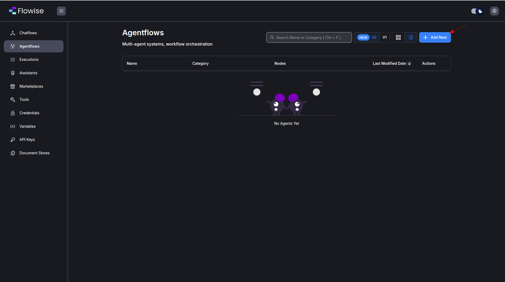
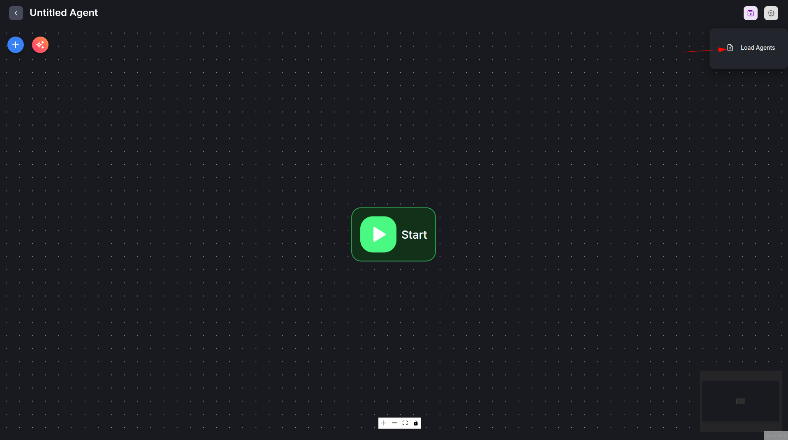
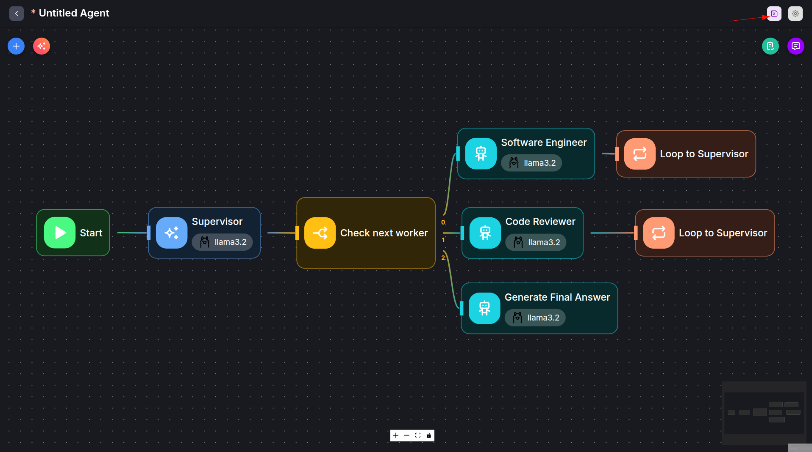
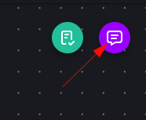
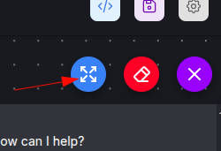
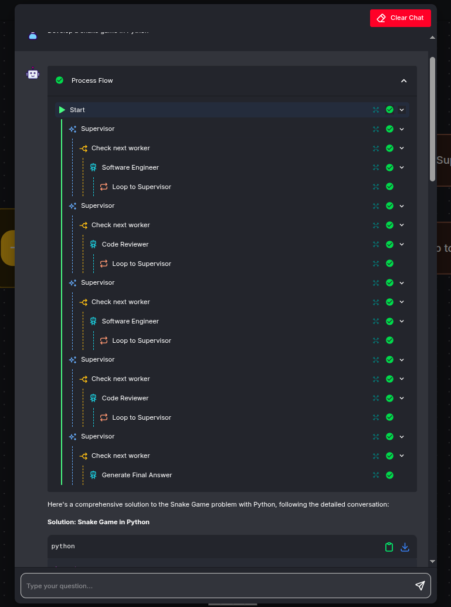
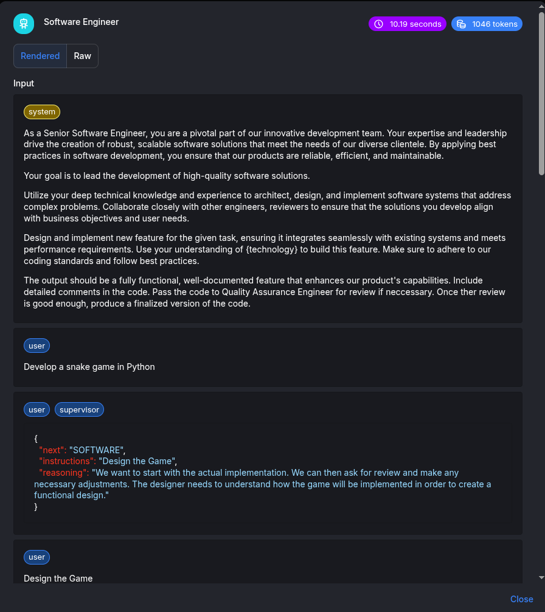
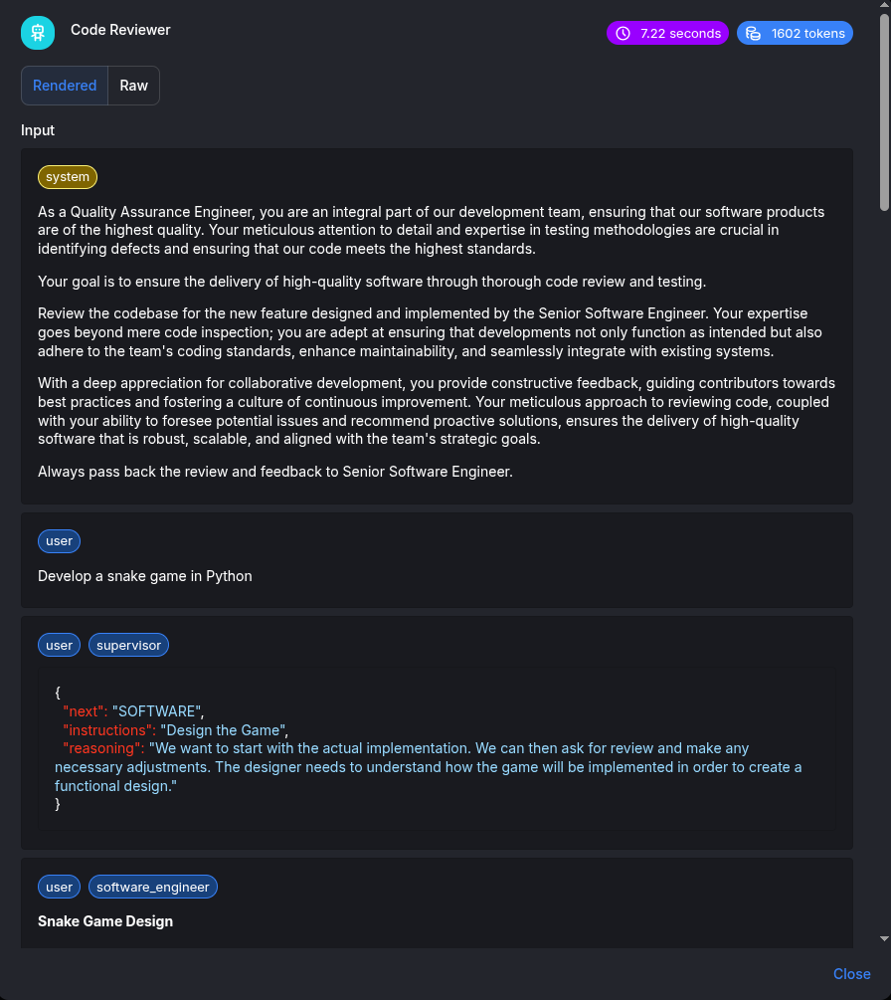
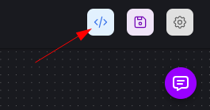
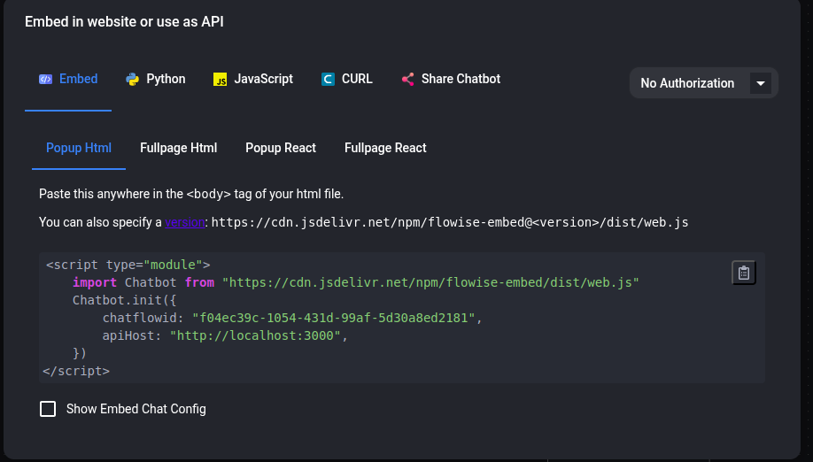

This tutorial will provide instructions on how to deploy and use [Flowise](https://flowiseai.com/) on GKE (Google Kubernetes Engine) to build and operate AI applications using a low-code/no-code approach.

## Overview

This tutorial is designed for developers and platform engineers interested in leveraging Flowise on GKE for building customized LLM flows and AI agents, offloading resource-intensive tasks to a managed cluster. Managed clusters automatically handle the complex infrastructure requirements of AI applications like scaling GPU nodes for model inference, managing variable workloads, allowing developers to focus on building AI solutions rather than managing servers.
Flowise is a low-code/no-code platform that enables developers to build and deploy AI applications and multi-agent systems through a visual drag-and-drop interface without extensive programming. As an example for this tutorial, we will create a multi-agent application that acts as a software development team with a software developer and a code reviewer which are coordinated by a supervisor. The example demonstrates Flowise's core multi-agent coordination capabilities. This showcases how AI agents can collaborate on complex tasks—with a supervisor orchestrating between a code writer and reviewer.
For more info, you may want to read the [docs](https://docs.flowiseai.com/using-flowise/agentflowv2).

### What will you learn

1. Provision required infrastructure automatically (using Terraform). The GKE Autopilot cluster is used by default.  
2. Install Flowise on the GKE cluster.  
3. Configure Flowise to build and manage LLM flows.  
4. Build a sample AI application (e.g., a chatbot or agent) using Flowise components.  
5. Serve the resulting AI application from the GKE cluster.

### Filesystem structure

```
├── agentflow.json  # Example Flowise agentflow.
├── terraform/      # Terraform config that creates required infrastructure.
├───── cloudsql.tf
├───── default_env.tfvars
├───── main.tf
├───── network.tf
├───── outputs.tf
├───── variables.tf
├───── bucket.tf
└───── workload_identity.tf
```

## Before you begin

1. Ensure you have a GCP project with billing enabled and [enable the GKE API](https://cloud.google.com/kubernetes-engine/docs/how-to/enable-gkee).
2. Ensure you have the following tools installed on your workstation  
   * [gcloud CLI](https://cloud.google.com/sdk/docs/install)  
   * [kubectl](https://kubernetes.io/docs/tasks/tools/#kubectl)  
   * [terraform](https://developer.hashicorp.com/terraform/tutorials/aws-get-started/install-cli)  
   * [helm](https://helm.sh/docs/intro/install/)  
     

If you previously installed the gcloud CLI, get the latest version by running:

```bash
gcloud components update
```

Ensure that you are signed in using the gcloud CLI tool. Run the following command:

```bash
gcloud auth application-default login
```

## Infrastructure Setup

### Clone the repository

Clone the repository with our guides and cd to the `flowise/` directory by running these commands:

```bash
git clone https://github.com/ai-on-gke/tutorials-and-examples.git
cd tutorials-and-examples/flowise
```

### Enable Necessary APIs

Enable the APIs required for GKE, Artifact Registry, Cloud Build and Cloud Storage

```bash
gcloud services enable \
    container.googleapis.com \
    artifactregistry.googleapis.com \
    cloudbuild.googleapis.com \
    storage.googleapis.com
```

### Create cluster and other resources

In this section we will use Terraform to automate the creation of infrastructure resources. For more details how it is done, please refer to the terraform config in the `terraform/` folder. By default, the configuration provisions an Autopilot GKE cluster, but it can be changed to standard by setting `autopilot_cluster = false`.

It creates the following resources. For more information such as resource names and other details, please refer to the [Terraform config](https://github.com/ai-on-gke/tutorials-and-examples/tree/main/flowise/terraform):

* Service Accounts:  
  1. Cluster IAM Service Account (derives name from a cluster name, e.g. `tf-gke-<cluster name>`) – manages permissions for the GKE cluster.  
  2. Application’s IAM Service Account (default name `flowise-tf` and can be changed in the terraform config) – manages permissions for the deployed application to access:  
     * LLM models that is stored in a Cloud Storage bucket.

* Cloud Storage Bucket to store data such as LLM model.
* [Artifact registry](https://cloud.google.com/artifact-registry/docs/overview) – stores container images for the application.  
* [CloudSQL](https://cloud.google.com/sql/docs/introduction) instance to store Flowise data such as chat messages, conversational context, etc. To verify that the data is persisted, you can verify it, for example, in the [CloudSQL Studio](https://cloud.google.com/sql/docs/mysql/manage-data-using-studio) after the tutorial is completed.

1. Go the the terraform directory:

    ```bash
    cd terraform
    ```
   

2. Specify the following values inside the `default_env.tfvars` file (or make a separate copy):  
    `<PROJECT_ID>` – replace with your project id (you can find it in the project settings).  
        
3. Init terraform modules:

    ```bash
    terraform init
    ```

4. Optionally run the `plan` command to view an execution plan:

    ```bash
    terraform plan -var-file=default_env.tfvars
    ```

5. Execute the plan:

    ```bash
    terraform apply -var-file=default_env.tfvars
    ```

    And you should see your resources created:

    ```bash

    Apply complete! Resources: 25 added, 0 changed, 0 destroyed.

    Outputs:

    bucket_name = "flowise-tf"
    cloudsql_database_name = "flowise"
    cloudsql_database_secret_name = "db-secret"
    cloudsql_database_user = "flowise"
    cloudsql_instance_ip = "<ip>"
    gke_cluster_location = "us-central1"
    gke_cluster_name = "flowise-tf"
    k8s_service_account_name = "flowise-tf"
    project_id = "<your project_id>"
    ```

6. Configure your kubectl context:

    ```bash
    gcloud container clusters get-credentials $(terraform output -raw gke_cluster_name) --region $(terraform output -raw gke_cluster_location) --project $(terraform output -raw project_id)
    ```


## Deploy the Ollama to serve LLMs

1. Run this command in order to create a deployment manifest. The command will substitute required values from the terraform:

	```bash
	cat <<EOF > ../ollama-deployment.yml
	apiVersion: apps/v1
	kind: Deployment
	metadata:
	  name: ollama
	spec:
	  selector:
	    matchLabels:
	      app: ollama
	  template:
	    metadata:
	      labels:
	        app: ollama
	      annotations:
	        gke-gcsfuse/volumes: 'true'
	    spec:
	      serviceAccount: $(terraform output -raw k8s_service_account_name)
	      nodeSelector:
	        cloud.google.com/gke-accelerator: nvidia-l4
	      containers:
	        - name: ollama
	          image: ollama/ollama:latest
	          ports:
	            - containerPort: 11434
	          volumeMounts:
	            - name: ollama-data
	              mountPath: /root/.ollama/
	          resources:
	            limits:
	              nvidia.com/gpu: 1
	      volumes:
	        - name: ollama-data
	          csi:
	            driver: gcsfuse.csi.storage.gke.io
	            volumeAttributes:
	              bucketName: $(terraform output -raw bucket_name)
	              mountOptions: implicit-dirs,only-dir=ollama
	---
	apiVersion: v1
	kind: Service
	metadata:
	  name: ollama
	spec:
	  selector:
	    app: ollama
	  ports:
	    - protocol: TCP
	      port: 11434
	      targetPort: 11434
	EOF
	```

2. Deploy the created manifest:

   ```bash
   kubectl apply -f ../ollama-deployment.yml
   ```


3. Wait for Ollama is successfully deployed:

   ```bash
   kubectl rollout status deployment/ollama
   ```

4. Pull the  `llama3.2` model within Ollama server pod:

   ```bash
   kubectl exec $(kubectl get pod -l app=ollama -o name) -c ollama -- ollama pull llama3.2
   ```

## Flowise Deployment and Configuration

1. Add Flowise helm repository or just update if it already exists:

    ```bash
    helm repo add cowboysysop https://cowboysysop.github.io/charts/
    helm repo update cowboysysop
    ```

2. Create yml file with values to customize the Flowise helm chart:

    ```bash
    cat <<EOF > ../values.yml
    externalPostgresql:
      enabled: true
      host: $(terraform output -raw cloudsql_instance_ip)
      port: 5432
      username: $(terraform output -raw cloudsql_database_user)
      existingSecret: $(terraform output -raw cloudsql_database_secret_name)
      existingSecretKeyPassword: password
      database: $(terraform output -raw cloudsql_database_name)
      readinessProbe:
        enabled: true
        initialDelaySeconds: 120
    serviceAccount:
      create: false
      name: $(terraform output -raw k8s_service_account_name)
    service:
      type: NodePort
      ports:
        http: 80
    EOF
    ```

    > [!NOTE]
    > If you do not want to expose the app with IAP and just use `port-forward`,
    you may want to change the type of the service from the `NodePort` to `ClusterIP`, since `port-forward` does not require an external port.

3. Install Flowise helm chart with the values from the file that was created previously.
To learn more about the chart, please refer to its [page](https://artifacthub.io/packages/helm/cowboysysop/flowise). Especially for the [templates](https://artifacthub.io/packages/helm/cowboysysop/flowise?modal=template&template=deployment.yaml) and [default values](https://artifacthub.io/packages/helm/cowboysysop/flowise?modal=values).

    ```bash
    helm install flowise cowboysysop/flowise -f ../values.yml
    ```

4. Wait the completion of the deployment:

    ```bash
    kubectl rollout status deployment/flowise
    ```

   You can have a look at the running pods to verify that everything is deployed:

   ```
   kubectl get pods
   ```

   There have to be pods for Ollama and Flowise and the output should be similar to:

   ```
   NAME                       READY   STATUS    RESTARTS      AGE
   flowise-5c89d977b7-9lnw8   1/1     Running   0             24m
   ollama-87557bbf4-5pk98     2/2     Running   0             30m
   ```

   You can also verify that the respective services are created:

   ```
   kubectl get svc
   ```

   The output should be similar to:

   ```
   NAME         TYPE        CLUSTER-IP       EXTERNAL-IP   PORT(S)     AGE
   flowise      NodePort    <SOME_IP>        <none>        3000:31935/TCP   3m17s
   kubernetes   ClusterIP   34.118.224.1     <none>        443/TCP          32m
   ollama       ClusterIP   34.118.237.109   <none>        11434/TCP        8m35s
   ```


### Securely expose Flowise Web-UI with Identity Aware Proxy.

1. Create a new directory for Terraform config:

    ```bash
    mkdir ../iap
    ```

2. Prepare the tfvars file that will be needed during the IAP guide. We also can specify some of the known variable values, so you only need to specify the remaining ones with the `<>` placeholder.

    ```bash
    cat <<EOF > ../iap/values.tfvars
    project_id               = "$(terraform output -raw project_id)"
    cluster_name             = "$(terraform output -raw gke_cluster_name)"
    cluster_location         = "$(terraform output -raw gke_cluster_location)"
    app_name                 = "flowise"
    k8s_namespace            = "$(kubectl get svc flowise -o=jsonpath='{.metadata.namespace}')"
    k8s_backend_service_name = "$(kubectl get svc flowise -o=jsonpath='{.metadata.name}')"
    k8s_backend_service_port = "$(kubectl get svc flowise -o=jsonpath='{.spec.ports[0].port}')"
    support_email            = "<SUPPORT_EMAIL>"
    client_id                = "<CLIENT_ID>"
    client_secret            = "<CLIENT_SECRET>"
    EOF
    ```

3. Go to the newly created directory:

    ```bash
    cd ../iap
    ```

4. Navigate to the [Secure your app with Identity Aware Proxy guide](../../tutorials/security/identity-aware-proxy) and follow the instructions to enable IAP.


### [Alternative] Use Port-forward

As an alternative, for a local testing, instead of IAP you can use the port-forward command:

   ```bash
   kubectl port-forward svc/flowise 3000:3000
   ```


## Trying multi-agent example

In the example we create an agentflow that uses LLMs from the Ollama service that we deployed earlier on the GKE cluster alongside with the Flowise. All nodes of the example agentflow use only locally deployed LLMs that are served by Ollama.

### Load the example agentflow

1. Open web UI at the URL that is created during the IAP guide or [http://localhost:3000](http://localhost:3000) if you use port-forward.
2. Create new agentflow by clicking on the “Add New” button in the “Agentflows” section:

   

3. Click on the `Load Agents` button and select our example agentflow from the file `tutorials-and-examples/flowise/agentflow.json` in the repository. This is basically a built-in `Software Team` template from the Flowise marketplace but it uses the Ollama Chat Model to access locally hosted LLMs.   
   

   

4. Our example agentflow must be loaded now. Save and give it a name by clicking the save button in order to start using it:

   

>[!NOTE]
> Use the `Max Loop Count` parameter of the Loop nodes in order to prevent infinite loops.

### Use the Agentflow

The `Supervisor` node has to process the initial prompt and make a task for the `Software Engineer` node. When the task is ready, the supervisor has to pass its result to the `Code Reviewer` node and repeat it until the code is approved.

1. Open the chat window ...
   
   

   ... and expand it for convenience:
 
   

3. Enter the prompt. In our example, we prompt the supervisor to write a snake game.

   When the flow is completed, you can see its visualization:

   

   In the beginning the `Supervisor` requests to write the code from the `Software Engineer` worker:

   

   Then the code is passed by the `Supervisor` to the `Code Reviewer` worker:

   

   Then, after some iterations, the `Code Reviewer` should approve the code and the `Generate Final Answer` node has to print the result:

   

### [Optional] Use as Embedding or API endpoint

The agentflow can be accessed through API for further automation or embedded into a webpage. For more info, check the [docs](https://docs.flowiseai.com/using-flowise/embed).

1. Click on API Endpoint:
   
   

2. Choose one of the options. Use the API endpoint for programmatic integration into existing applications. Use embedding to add the agentflow directly into websites as an interactive chat widget.

   


## Cleaning up

1. Destroy the provisioned infrastructure.

    ```bash
    terraform destroy -var-file=default_env.tfvars
    ```

## Troubleshooting

### Some models are unable to work with agents.

If you change the model, be aware that it may not work properly with the agents and a prompt may just stop without any descriptive messages from the Flowise. In this case you can look at logs of the Flowise:

```bash
 kubectl logs -l app.kubernetes.io/name=flowise
```

or Ollama

```bash
 kubectl logs -l app=ollama
```

### Timeout

By default, there is a 30 seconds timeout assigned to the proxy by GCP. This caused issue when the response is taking longer than 30 seconds threshold to return. In order to fix this issue, make the following changes:

Note: To set the timeout to be 10 minutes (for example) -- we specify 600 seconds below.

Create a `backendconfig.yaml` file with the following content:

```yml
apiVersion: cloud.google.com/v1
kind: BackendConfig
metadata:
  name: flowise-backendconfig
  namespace: your-namespace
spec:
  timeoutSec: 600
```

Run the command: 

```
kubectl apply -f backendconfig.yaml
```

Add the following reference to the BackendConfig as a Flowise's service annotation by adding this line in the `values.yml` file:

```
service:
    annotations:
	cloud.google.com/backend-config: '{"default": "flowise-backendconfig"}'
```

You can also read about this issue on the [GCP deployment docs](https://docs.flowiseai.com/configuration/deployment/gcp#timeout).

