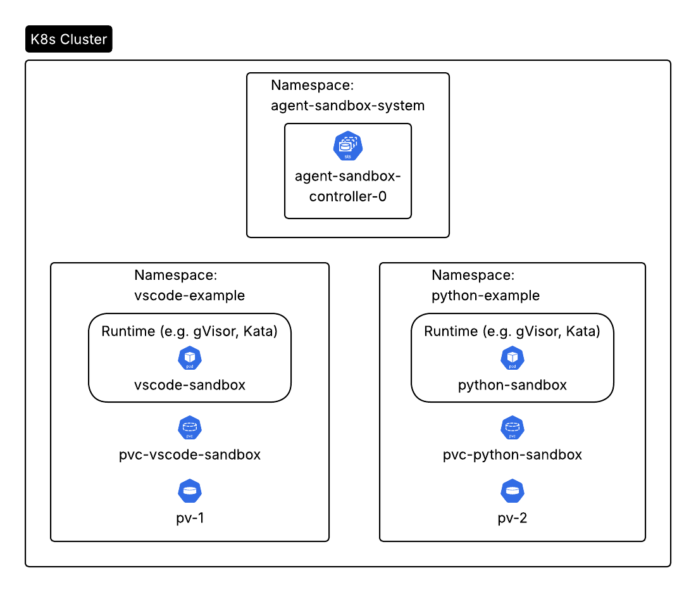

## Kubernetes Agent Sandbox

### Overview

The agent-sandbox is a Kubernetes SIGs project that aims to simplify the management of isolated workloads. It introduces a Sandbox Custom Resource Definition (CRD) and controller to provide a standardized API for managing workloads that require a long-running, stateful, single-container environment. This is particularly useful for development environments that execute untrusted or AI-generated code, AI agent runtimes, notebooks, and other services that are cumbersome to manage with existing Kubernetes primitives like StatefulSets. The project is vendor-neutral, supports various runtimes, and focuses on strong isolation by providing the ability to specify a more secure container runtime like gVisor. It also allows deep hibernation and efficient persistence.

## Diagram

