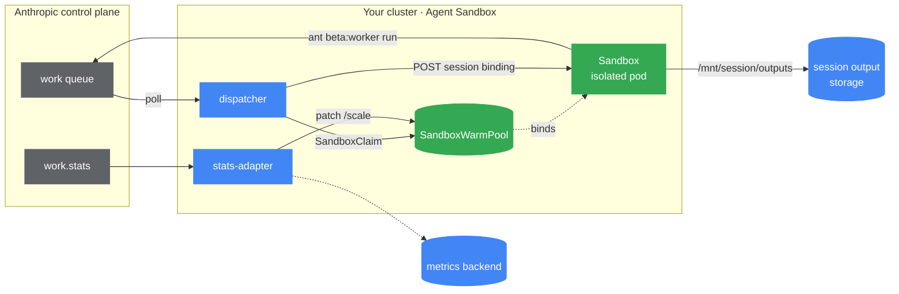

## Overview

[Anthropic Managed Agents](https://docs.claude.com/en/docs/agents-and-tools/managed-agents)
is a hosted agent loop — Claude, conversation state, and a per-environment _work
queue_ all run on Anthropic's control plane. In the
[**self-hosted sandbox**](https://docs.claude.com/en/docs/agents-and-tools/managed-agents/self-hosting)
configuration, Anthropic still runs the agent, but instead of executing tool
calls (`bash`, `read`, `write`, `grep`, …) on its own infrastructure it queues
each one and waits for _your_ cluster to pull it, run it, and post the result
back.

That pull worker is exactly the shape Agent Sandbox is built for: untrusted,
LLM-generated commands that need to run in an isolated, short-lived, pre-warmed
pod. This page explains how the Sandbox primitives — `SandboxWarmPool`,
`SandboxClaim`, and late binding — map onto that runtime.

A complete, runnable reference implementation (Terraform, Kustomize, the three
container images, and an end-to-end smoke test) lives in
[`GoogleCloudPlatform/kubernetes-engine-samples`](https://github.com/GoogleCloudPlatform/kubernetes-engine-samples/tree/main/ai-ml/anthropic-agent-sandbox).
This document is the conceptual companion to that code.



## Why a warm pool, not N long-lived workers

Anthropic's reference for self-hosting is "run N copies of `ant beta:worker
poll`". That works, but every replica is a long-lived process that holds the
environment key and keeps an open egress to `api.anthropic.com`, and every
session that lands on it shares the same `/workspace`.

Agent Sandbox lets you split the responsibilities:

- **One small dispatcher** polls the queue. It holds no untrusted code — it only
  binds claims.
- **Each work item gets a `SandboxClaim`**, which binds a pre-warmed pod from the
  `SandboxWarmPool` in well under a second, so a new session never waits on an
  image pull.
- **One session per pod.** The pod runs the worker for exactly one session and is
  torn down when the session ends. The blast radius of any single sandbox is one
  session.
- **The warm pool refills behind it**, keeping the next session fast.

## How it works

1. The **dispatcher** long-polls Anthropic's work queue.
2. For each work item it creates a `SandboxClaim`, which binds a ready pod from
   the `SandboxWarmPool`.
3. **Late binding.** The pod is already running before the dispatcher knows which
   session it will serve, so the session ID can't be passed as a container
   environment variable. Instead the worker image starts a tiny HTTP listener and
   blocks until the dispatcher POSTs `{session_id, work_id}` to it.
4. The worker then execs `ant beta:worker run`. `ant` acks the work item,
   downloads the agent's skills into the workspace, runs each tool call, and
   streams the results back to `api.anthropic.com`.
5. When the session goes idle the worker process exits, the controller deletes
   the sandbox, and the warm pool spins up a fresh replacement.

The `SandboxTemplate` describes the pod the warm pool keeps ready. It is a
normal pod spec, hardened for untrusted code — a non-root user, a read-only root
filesystem, dropped capabilities, and (recommended) a stronger runtime such as
[gVisor](/docs/use-cases/gvisor-isolation/):

```yaml
apiVersion: extensions.agents.x-k8s.io/v1beta1
kind: SandboxTemplate
metadata:
  name: claude-agent-worker
spec:
  podTemplate:
    spec:
      runtimeClassName: gvisor
      automountServiceAccountToken: false
      securityContext:
        runAsNonRoot: true
        runAsUser: 1000
      containers:
        - name: worker
          # The worker image: a :8080 listener that execs `ant beta:worker run`
          # once the dispatcher posts the session binding.
          image: <your-registry>/claude-agent-worker:<tag>
          ports:
            - { name: dispatch, containerPort: 8080 }
          securityContext:
            allowPrivilegeEscalation: false
            readOnlyRootFilesystem: true
            capabilities: { drop: ["ALL"] }
```

The dispatcher loop that drives it is short — poll, claim, and post the binding
to the bound pod:

```python
ant = anthropic.Anthropic(auth_token=os.environ["ANTHROPIC_ENVIRONMENT_KEY"])
sbx = SandboxClient(
    connection_config=SandboxInClusterConnectionConfig(use_pod_ip=True, server_port=8080)
)

while True:
    item = ant.beta.environments.work.poll(ENV_ID, block_ms=900)
    if item is None:
        continue

    sb = sbx.create_sandbox(
        warmpool="claude-agent-worker",
        namespace=NAMESPACE,
        labels={"anthropic.com/session-id": item.data.id},
    )
    pod = sb.k8s_helper.core_v1_api.read_namespaced_pod(sb.get_pod_name(), sb.namespace)
    urllib.request.urlopen(
        f"http://{pod.status.pod_ip}:8080/",
        data=json.dumps({"session_id": item.data.id, "work_id": item.id}).encode(),
    )
```

Two details that matter in practice: the environment key is a bearer token, so it
goes in `auth_token=` (not `api_key=`); and the dispatcher reads the bound pod's
IP directly, because the per-claim headless Service's DNS record is too new to
resolve reliably on the first call.

## Securing the worker

Because the worker runs untrusted, model-generated commands, lock its network
down to exactly what the worker needs. The portable core is a **default-deny
`NetworkPolicy`** that allows only:

- **Ingress** from the dispatcher (so only it can post a session binding), and
- **Egress** to cluster DNS plus `api.anthropic.com`.

`NetworkPolicy` selectors can't match an external hostname, so the
`api.anthropic.com` allow-list needs a hostname-aware egress mechanism. This is
the part that varies by platform: the GKE reference implementation uses a
[`FQDNNetworkPolicy`](https://cloud.google.com/kubernetes-engine/docs/how-to/fqdn-network-policies),
but any equivalent egress control on your platform works just as well. Keep the
default-deny `NetworkPolicy` as the base layer and add your platform's allow-list
on top.

Setting `automountServiceAccountToken: false` keeps the Kubernetes
service-account token out of the pod, so the `bash` tool has no in-cluster API
credentials. The only Anthropic credential in the pod is the per-environment key.

## Persisting session outputs

The Anthropic worker harness writes final deliverables to a known path
(`/mnt/session/outputs`). Backing that path with persistent storage lets outputs
survive the short-lived pod. **Any standard storage works** — the GKE reference
uses the
[GCS FUSE CSI driver](https://cloud.google.com/kubernetes-engine/docs/how-to/persistent-volumes/cloud-storage-fuse-csi-driver),
but a `PersistentVolumeClaim` backed by NFS, a cloud block/file store, or any
other CSI driver is a drop-in substitute.

Because a warm pod doesn't yet know its session ID, mount the storage at a fixed
path and let the worker's entrypoint symlink `/mnt/session/outputs` to a
session-scoped subdirectory after dispatch — the same late-binding trick used for
the session ID itself.

## Running it on GKE

The reference implementation targets GKE Autopilot with the Agent Sandbox add-on
(`gcloud beta container clusters update … --enable-agent-sandbox`).

The add-on is the **Google-managed install of this same project**. Google runs
the controller and CRDs for you, and wires in GKE-native pieces like gVisor nodes
and the admission policy below. It is not a different API. Everything on this page
works on a self-managed OSS install too; the only thing that changes is how the
controller gets onto the cluster:

|                               | Agent Sandbox add-on (GKE)        | OSS install (any cluster)                                                                                                                                            |
| ----------------------------- | --------------------------------- | -------------------------------------------------------------------------------------------------------------------------------------------------------------------- |
| **Deployment**                | `gcloud … --enable-agent-sandbox` | `kubectl apply -f …/manifest.yaml` then `…/extensions.yaml` for `SandboxWarmPool`/`SandboxTemplate`/`SandboxClaim` (or Helm with `--set controller.extensions=true`) |
| **Who runs the controller**   | Google-managed                    | You                                                                                                                                                                  |
| **API version served**        | `v1alpha1` (currently)            | `v1beta1`                                                                                                                                                            |
| **gVisor + admission policy** | provisioned by GKE                | you bring `runtimeClassName` / node pool and any admission policy                                                                                                    |

To swap from the add-on to OSS, skip `--enable-agent-sandbox`, apply the OSS
manifests above, and bump the manifests' `apiVersion` from `v1alpha1` to
`v1beta1` (the `apiVersion` note at the end of this section). To go the other
way, drop the OSS controller install and the `runtimeClassName: gvisor` becomes a
managed GKE node taint you tolerate rather than a class you provision. The
dispatcher, worker, network policy, and storage setup are identical either way.

On GKE 1.35.5 and later, the cluster ships a
[Validating Admission Policy](/docs/use-cases/examples/secure-sandbox-vap/)
(`secure-sandbox-policy`) that denies any sandbox whose pod spec doesn't tolerate
the gVisor node taint. Add the toleration to the `SandboxTemplate`:

```yaml
tolerations:
  - key: sandbox.gke.io/runtime
    operator: Equal
    value: gvisor
    effect: NoSchedule
```

Note that the OSS controller in this repo serves both API groups —
`agents.x-k8s.io` (the core `Sandbox`) and `extensions.agents.x-k8s.io` (the
`SandboxWarmPool`, `SandboxTemplate`, and `SandboxClaim`) — at `v1beta1`, while
the GKE add-on currently serves `v1alpha1`. The reference repo ships the
GKE-targeted versions; adjust the `apiVersion` to match the controller you're
running.

## Try it

From a fresh Google Cloud project, the
[reference implementation](https://github.com/GoogleCloudPlatform/kubernetes-engine-samples/tree/main/ai-ml/anthropic-agent-sandbox)
wraps everything above in three `make` targets:

```bash
git clone https://github.com/GoogleCloudPlatform/kubernetes-engine-samples
cd kubernetes-engine-samples/ai-ml/anthropic-agent-sandbox
cp .env.example .env   # fill in PROJECT_ID + Anthropic credentials
source .env

make infra    # Autopilot cluster + Agent Sandbox add-on
make images   # build the dispatcher, worker, and stats-adapter images
make deploy   # render manifests and apply
```

Then ask the agent where it's running — it will execute `uname -a` inside the
sandbox, see gVisor's synthetic kernel, and tell you it's on a hardened pod
without being told.

## References

- [Reference implementation — `kubernetes-engine-samples/ai-ml/anthropic-agent-sandbox`](https://github.com/GoogleCloudPlatform/kubernetes-engine-samples/tree/main/ai-ml/anthropic-agent-sandbox)
- [Anthropic Managed Agents — self-hosting](https://docs.claude.com/en/docs/agents-and-tools/managed-agents/self-hosting)
- [gVisor Isolation](/docs/use-cases/gvisor-isolation/)
- [Secure Sandbox Admission Policy (VAP)](/docs/use-cases/examples/secure-sandbox-vap/)
