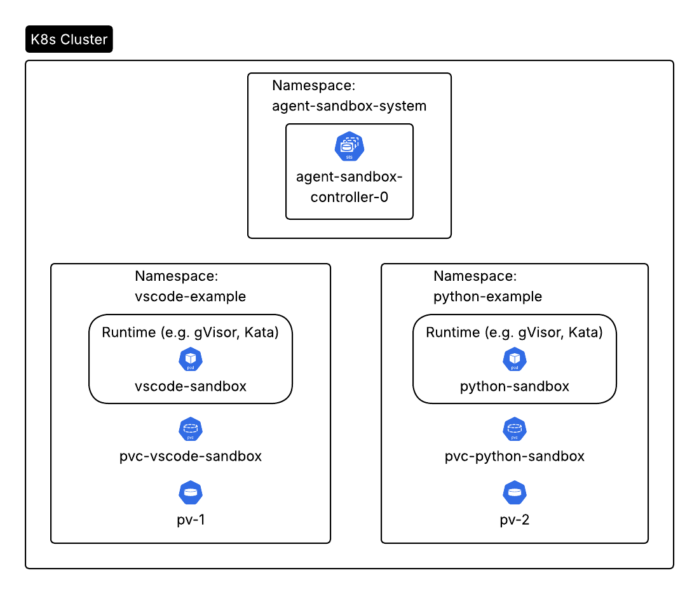

Agent Sandbox represents a critical new layer of AI infrastructure that provides a controlled, isolated execution environment for code execution and computer use used in AI Agents and Reinforcement Learning (RL).

## Why use Agent Sandbox? 
Agent Sandbox is cloud agnostic, and can be used on top of any implementation of Kubernetes. By acting as a secure, contained "isolated environment", Agent Sandbox ensures that untrusted or dynamically generated code or commands are isolated, preventing potential risks such as compromising production systems, accidentally corrupting data, or accessing unauthorized hosts. This environment is engineered for high-scale, secure deployment, offering strong isolation capabilities, alongside advanced lifecycle features such as suspending, and warm pools to achieve low-latency performance necessary for scalable agent platforms.

## Features Overview 
Agent Sandbox - This core resource provides a declarative KRM API for managing isolated, single-instance execution environments, ensuring each Sandbox is unique and disposable.
Suspend/Resume - Allows users to pause sandboxes—which deletes the Pod while preserving state via the PVC and Service—and resume them by recreating the Pod.
WarmPools - The Sandbox Warm Pool Orchestrator utilizes a dedicated CRD to maintain a pool of pre-warmed pods, allowing the Sandbox Controller to claim a ready instance upon creation to mitigate cold start latency.
Time to Live (TTL) - Automates deletion using configurable duration (.spec.ttl.seconds) and start policies (.spec.ttl.startPolicy) to set a .status.shutdownAt time, after which the sandbox is immediately removed.
Python API/SDK - Provides a developer-friendly interface to programmatically interact with these CRDs, abstracting away Kubernetes complexities.

